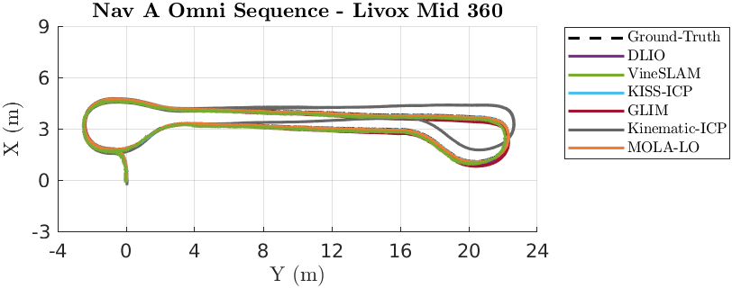
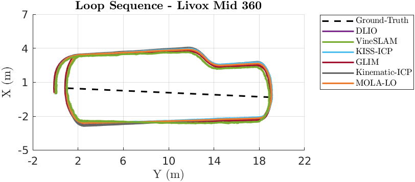
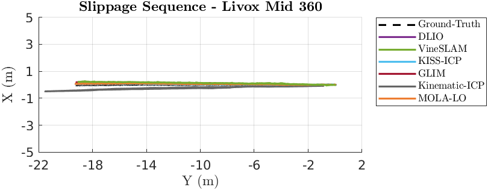
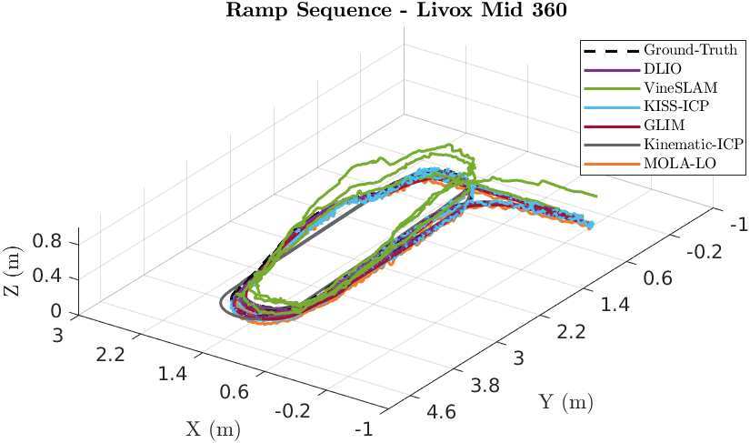
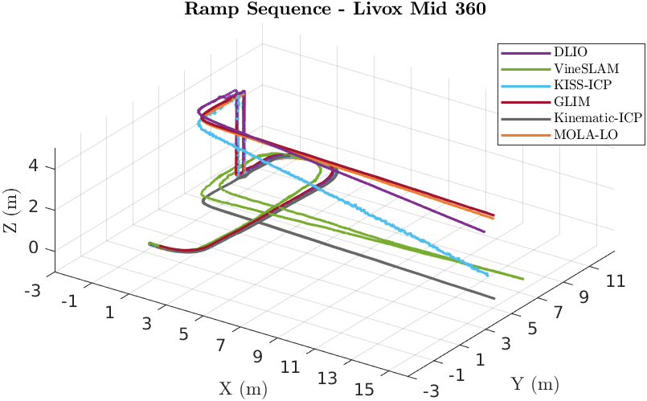

# Livox Mid-360

## Absolute Trajectory Error (ATE)

Root Mean Square Error (RMSE) of the absolute position differences. Values are presented in meters (m).

| 3D LiDAR Sensor              | Nav A Diff     | Nav A Omni     | Loop           | Slippage       | Ramp           |
| :--------------------------- | :------------: | :------------: | :------------: | :------------: | :------------: |
| **A-LOAM**                   | -              | -              | -              | -              | -              |
| **LeGO-LOAM-BOR**            | -              | -              | -              | -              | -              |
| **LIORF**                    | -              | -              | -              | -              | -              |
| **DLIO**                     | 0.027 m        | 0.021 m        | <u>0.017</u> m | 0.030 m        | <u>0.012</u> m |
| **VineSLAM**                 | 0.188 m        | 0.106 m        | 0.124 m        | 0.096 m        | 0.108 m        |
| **KISS-ICP**                 | 0.031 m        | 0.030 m        | 0.026 m        | 0.033 m        | 0.028 m        |
| **GLIM**                     | <u>0.017</u> m | <u>0.016</u> m | 0.104 m        | <u>0.025</u> m | 0.057 m        |
| **Kinematic-ICP**            | 0.085 m        | 0.181 m        | 0.053 m        | 0.584 m        | -              |
| **MOLA-LO**                  | 0.025 m        | 0.022 m        | 0.018 m        | 0.027 m        | 0.023 m        |

## Relative Translational Error (RTE)

Mean value calculated over all 10-meter segments. Values are presented as a percentage (%).

| 3D LiDAR Sensor              | Nav A Diff   | Nav A Omni   | Loop         | Slippage     | Ramp         |
| :--------------------------- | :----------: | :----------: | :----------: | :----------: | :----------: |
| **A-LOAM**                   | -            | -            | -            | -            | -            |
| **LeGO-LOAM-BOR**            | -            | -            | -            | -            | -            |
| **LIORF**                    | -            | -            | -            | -            | -            |
| **DLIO**                     | 1.01%        | 0.99%        | 1.14%        | 0.92%        | 0.17%        |
| **VineSLAM**                 | 2.70%        | 1.95%        | 2.07%        | 1.56%        | 1.12%        |
| **KISS-ICP**                 | <u>0.76</u>% | <u>0.75</u>% | <u>0.83</u>% | 0.95%        | 0.53%        |
| **GLIM**                     | 0.78%        | 0.81%        | 1.76%        | <u>0.82</u>% | 0.64%        |
| **Kinematic-ICP**            | 1.62%        | 2.31%        | 1.38%        | 7.45%        | -            |
| **MOLA-LO**                  | 0.77%        | 0.77%        | 0.98%        | 0.93%        | <u>0.26</u>% |

## Relative Rotational Error (RRE)

Mean value calculated over all 10-meter segments. Values are presented in degrees per meter (°/m).

| 3D LiDAR Sensor              | Nav A Diff       | Nav A Omni       | Loop             | Slippage         | Ramp             |
| :--------------------------- | :--------------: | :--------------: | :--------------: | :--------------: | :--------------: |
| **A-LOAM**                   | -                | -                | -                | -                | -                |
| **LeGO-LOAM-BOR**            | -                | -                | -                | -                | -                |
| **LIORF**                    | -                | -                | -                | -                | -                |
| **DLIO**                     | 0.056 °/m        | 0.069 °/m        | 0.050 °/m        | 0.042 °/m        | 0.073 °/m        |
| **VineSLAM**                 | 0.223 °/m        | 0.188 °/m        | 0.146 °/m        | 0.072 °/m        | 0.335 °/m        |
| **KISS-ICP**                 | 0.064 °/m        | 0.067 °/m        | 0.059 °/m        | 0.052 °/m        | 0.099 °/m        |
| **GLIM**                     | <u>0.044</u> °/m | <u>0.052</u> °/m | <u>0.036</u> °/m | <u>0.039</u> °/m | <u>0.055</u> °/m |
| **Kinematic-ICP**            | 0.066 °/m        | 0.108 °/m        | 0.084 °/m        | 0.106 °/m        | -                |
| **MOLA-LO**                  | 0.057 °/m        | 0.063 °/m        | 0.058 °/m        | 0.047 °/m        | 0.056 °/m        |

## Trajectory Plots

### Nav A Diff Sequence

### Nav A Omni Sequence

### Loop Sequence

### Slippage Sequence

### Ramp Sequence

### Elevator Sequence
