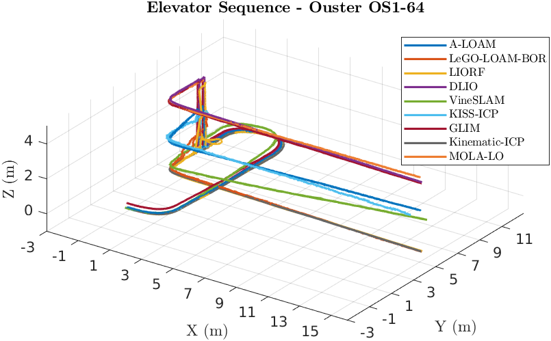

# Ouster OS1-64

## Absolute Trajectory Error (ATE)

Root Mean Square Error (RMSE) of the absolute position differences. Values are presented in meters (m).

| 3D LiDAR Sensor              | Nav A Diff     | Nav A Omni     | Loop           | Slippage       | Ramp           |
| :--------------------------- | :------------: | :------------: | :------------: | :------------: | :------------: |
| **A-LOAM**                   | 0.039 m        | 0.043 m        | 0.029 m        | 0.041 m        | 0.038 m        |
| **LeGO-LOAM-BOR**            | 0.042 m        | 0.036 m        | 0.033 m        | 0.045 m        | 0.036 m        |
| **LIORF**                    | 0.032 m        | 0.031 m        | 0.021 m        | <u>0.028</u> m | 0.017 m        |
| **DLIO**                     | 0.042 m        | 0.032 m        | 0.029 m        | 0.044 m        | 0.020 m        |
| **VineSLAM**                 | 0.144 m        | 0.139 m        | 0.143 m        | 0.147 m        | 0.086 m        |
| **KISS-ICP**                 | 0.036 m        | 0.038 m        | 0.032 m        | 0.035 m        | 0.030 m        |
| **GLIM**                     | 0.029 m        | <u>0.021</u> m | 0.034 m        | 0.036 m        | 0.053 m        |
| **Kinematic-ICP**            | 0.510 m        | 0.191 m        | 0.152 m        | 0.788 m        | -              |
| **MOLA-LO**                  | <u>0.028</u> m | 0.026 m        | <u>0.020</u> m | <u>0.028</u> m | <u>0.015</u> m |

## Relative Translational Error (RTE)

Mean value calculated over all 10-meter segments. Values are presented as a percentage (%).

| 3D LiDAR Sensor              | Nav A Diff   | Nav A Omni   | Loop         | Slippage     | Ramp         |
| :--------------------------- | :----------: | :----------: | :----------: | :----------: | :----------: |
| **A-LOAM**                   | 1.11%        | 1.34%        | 1.15%        | 1.18%        | 0.39%        |
| **LeGO-LOAM-BOR**            | 1.14%        | 1.23%        | 1.43%        | 1.44%        | 0.52%        |
| **LIORF**                    | 1.06%        | 1.24%        | 1.31%        | 1.19%        | 0.21%        |
| **DLIO**                     | 1.40%        | 1.49%        | 1.41%        | 1.23%        | <u>0.19</u>% |
| **VineSLAM**                 | 2.61%        | 2.86%        | 2.83%        | 2.57%        | 1.08%        |
| **KISS-ICP**                 | 1.07%        | 1.10%        | <u>1.00</u>% | <u>1.12</u>% | 0.64%        |
| **GLIM**                     | 1.15%        | 1.18%        | 1.17%        | 1.23%        | 0.34%        |
| **Kinematic-ICP**            | 3.18%        | 2.59%        | 1.95%        | 9.94%        | -            |
| **MOLA-LO**                  | <u>0.97</u>% | <u>1.07</u>% | 1.06%        | <u>1.12</u>% | 0.24%        |

## Relative Rotational Error (RRE)

Mean value calculated over all 10-meter segments. Values are presented in degrees per meter (°/m).

| 3D LiDAR Sensor              | Nav A Diff       | Nav A Omni       | Loop             | Slippage         | Ramp             |
| :--------------------------- | :--------------: | :--------------: | :--------------: | :--------------: | :--------------: |
| **A-LOAM**                   | 0.072 °/m        | 0.089 °/m        | 0.080 °/m        | 0.088 °/m        | 0.052 °/m        |
| **LeGO-LOAM-BOR**            | 0.097 °/m        | 0.106 °/m        | 0.083 °/m        | 0.104 °/m        | 0.150 °/m        |
| **LIORF**                    | <u>0.060</u> °/m | <u>0.070</u> °/m | <u>0.055</u> °/m | <u>0.057</u> °/m | <u>0.026</u> °/m |
| **DLIO**                     | 0.086 °/m        | 0.110 °/m        | 0.083 °/m        | 0.062 °/m        | 0.080 °/m        |
| **VineSLAM**                 | 0.201 °/m        | 0.242 °/m        | 0.251 °/m        | 0.153 °/m        | 0.369 °/m        |
| **KISS-ICP**                 | 0.073 °/m        | 0.079 °/m        | 0.063 °/m        | 0.069 °/m        | 0.087 °/m        |
| **GLIM**                     | 0.066 °/m        | 0.075 °/m        | 0.058 °/m        | 0.074 °/m        | 0.050 °/m        |
| **Kinematic-ICP**            | 0.224 °/m        | 0.172 °/m        | 0.137 °/m        | 0.135 °/m        | -                |
| **MOLA-LO**                  | 0.070 °/m        | 0.080 °/m        | 0.057 °/m        | 0.064 °/m        | 0.054 °/m        |

## Trajectory Plots

### Nav A Diff Sequence

### Nav A Omni Sequence

### Loop Sequence

### Slippage Sequence

### Ramp Sequence

### Elevator Sequence
