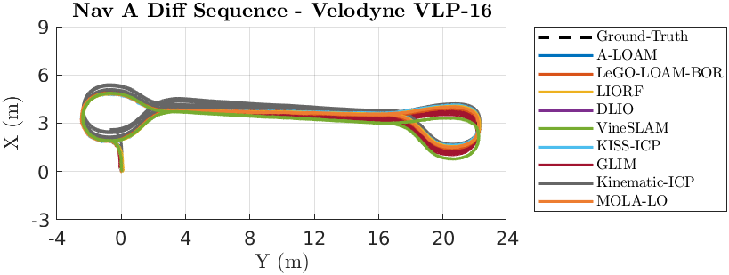
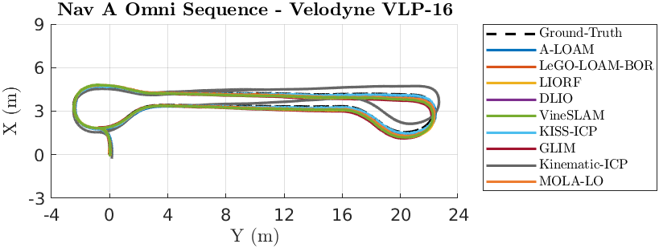
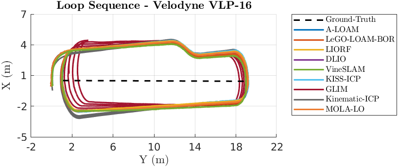
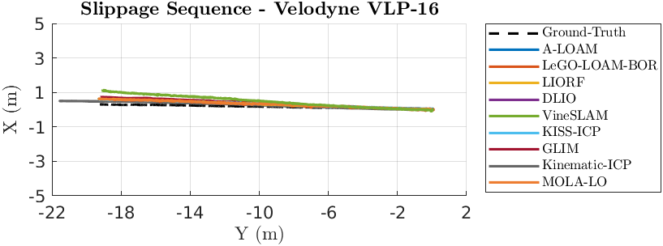
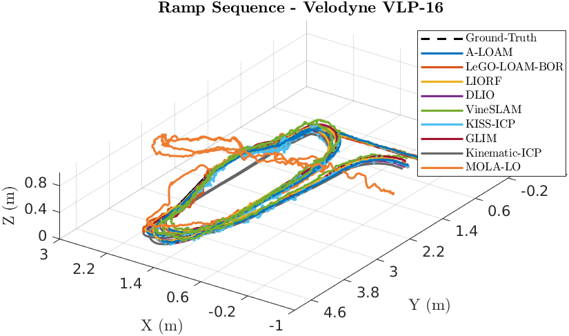
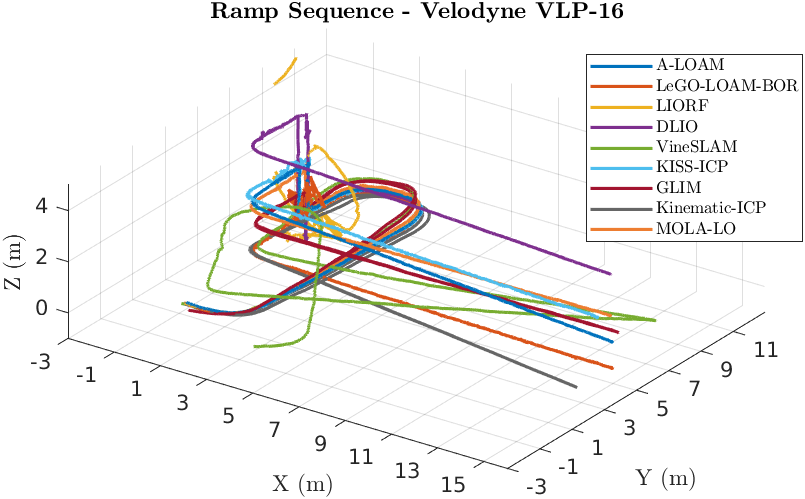

# Velodyne VLP-16

## Absolute Trajectory Error (ATE)

Root Mean Square Error (RMSE) of the absolute position differences. Values are presented in meters (m).

| 3D LiDAR Sensor              | Nav A Diff     | Nav A Omni     | Loop           | Slippage       | Ramp           |
| :--------------------------- | :------------: | :------------: | :------------: | :------------: | :------------: |
| **A-LOAM**                   | 0.031 m        | 0.049 m        | 0.039 m        | 0.040 m        | 0.031 m        |
| **LeGO-LOAM-BOR**            | 0.054 m        | 0.047 m        | 0.042 m        | 0.053 m        | 0.050 m        |
| **LIORF**                    | <u>0.030</u> m | <u>0.027</u> m | <u>0.025</u> m | <u>0.035</u> m | <u>0.030</u> m |
| **DLIO**                     | 0.064 m        | 0.049 m        | 0.036 m        | 0.065 m        | 0.031 m        |
| **VineSLAM**                 | 0.083 m        | 0.089 m        | 0.128 m        | 0.077 m        | 0.048 m        |
| **KISS-ICP**                 | 0.052 m        | 0.047 m        | 0.045 m        | 0.045 m        | 0.041 m        |
| **GLIM**                     | 0.525 m        | 0.286 m        | 1.563 m        | 0.082 m        | 0.068 m        |
| **Kinematic-ICP**            | 0.183 m        | 0.180 m        | 0.147 m        | 0.676 m        | -              |
| **MOLA-LO**                  | 0.045 m        | 0.040 m        | 0.037 m        | 0.039 m        | 0.338 m        |

## Relative Translational Error (RTE)

Mean value calculated over all 10-meter segments. Values are presented as a percentage (%).

| 3D LiDAR Sensor              | Nav A Diff   | Nav A Omni   | Loop         | Slippage     | Ramp         |
| :--------------------------- | :----------: | :----------: | :----------: | :----------: | :----------: |
| **A-LOAM**                   | <u>1.28</u>% | 1.58%        | 1.68%        | 1.53%        | 0.38%        |
| **LeGO-LOAM-BOR**            | 1.33%        | 1.43%        | 1.67%        | 1.87%        | 0.75%        |
| **LIORF**                    | 1.33%        | 1.43%        | 1.63%        | <u>1.40</u>% | 0.36%        |
| **DLIO**                     | 1.77%        | 1.81%        | 1.69%        | 1.42%        | <u>0.30</u>% |
| **VineSLAM**                 | 2.03%        | 2.00%        | 2.24%        | 2.18%        | 0.62%        |
| **KISS-ICP**                 | 1.41%        | <u>1.38</u>% | <u>1.50</u>% | 1.56%        | 0.91%        |
| **GLIM**                     | 2.99%        | 2.73%        | 18.69%       | 2.38%        | 0.82%        |
| **Kinematic-ICP**            | 2.43%        | 2.45%        | 1.96%        | 8.63%        | -            |
| **MOLA-LO**                  | 1.41%        | 1.48%        | 1.69%        | 1.54%        | 3.53%        |

## Relative Rotational Error (RRE)

Mean value calculated over all 10-meter segments. Values are presented in degrees per meter (°/m).

| 3D LiDAR Sensor              | Nav A Diff       | Nav A Omni       | Loop             | Slippage         | Ramp             |
| :--------------------------- | :--------------: | :--------------: | :--------------: | :--------------: | :--------------: |
| **A-LOAM**                   | 0.066 °/m        | 0.084 °/m        | 0.104 °/m        | 0.083 °/m        | 0.072 °/m        |
| **LeGO-LOAM-BOR**            | 0.114 °/m        | 0.110 °/m        | 0.119 °/m        | 0.151 °/m        | 0.189 °/m        |
| **LIORF**                    | 0.057 °/m        | 0.064 °/m        | 0.086 °/m        | 0.084 °/m        | 0.078 °/m        |
| **DLIO**                     | 0.095 °/m        | 0.121 °/m        | 0.093 °/m        | 0.075 °/m        | 0.112 °/m        |
| **VineSLAM**                 | 0.147 °/m        | 0.166 °/m        | 0.182 °/m        | 0.148 °/m        | 0.283 °/m        |
| **KISS-ICP**                 | 0.093 °/m        | 0.091 °/m        | 0.096 °/m        | 0.088 °/m        | 0.149 °/m        |
| **GLIM**                     | <u>0.048</u> °/m | <u>0.046</u> °/m | <u>0.083</u> °/m | <u>0.036</u> °/m | <u>0.040</u> °/m |
| **Kinematic-ICP**            | 0.140 °/m        | 0.152 °/m        | 0.137 °/m        | 0.093 °/m        | -                |
| **MOLA-LO**                  | 0.088 °/m        | 0.088 °/m        | 0.106 °/m        | 0.092 °/m        | 0.822 °/m        |

## Trajectory Plots

### Nav A Diff Sequence

### Nav A Omni Sequence

### Loop Sequence

### Slippage Sequence

### Ramp Sequence

### Elevator Sequence
