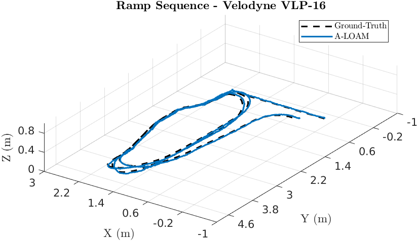
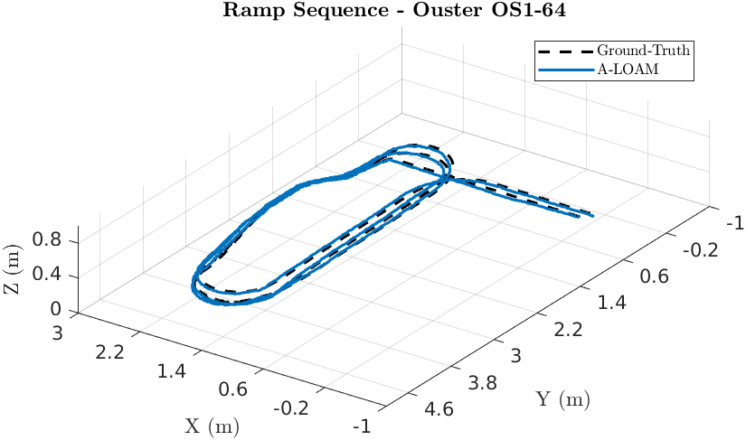
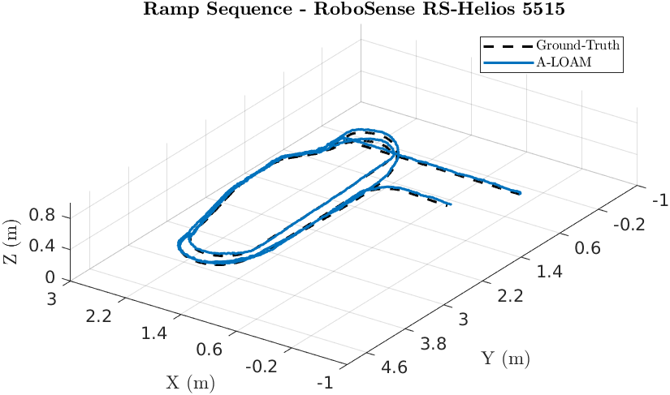

# A-LOAM

## Absolute Trajectory Error (ATE)

Root Mean Square Error (RMSE) of the absolute position differences. Values are presented in meters (m).

| 3D LiDAR Sensor              | Nav A Diff     | Nav A Omni     | Loop           | Slippage       | Ramp           |
| :--------------------------- | :------------: | :------------: | :------------: | :------------: | :------------: |
| **Velodyne VLP-16**          | 0.031 m        | 0.049 m        | 0.039 m        | <u>0.040</u> m | <u>0.031</u> m |
| **Ouster OS1-64**            | 0.039 m        | 0.043 m        | <u>0.029</u> m | 0.041 m        | 0.038 m        |
| **RoboSense RS-Helios-5515** | <u>0.032</u> m | <u>0.032</u> m | 0.045 m        | 0.042 m        | 0.057 m        |
| **Livox Mid 360**            | -              | -              | -              | -              | -              |

## Relative Translational Error (RTE)

Mean value calculated over all 10-meter segments. Values are presented as a percentage (%).

| 3D LiDAR Sensor              | Nav A Diff   | Nav A Omni   | Loop         | Slippage     | Ramp         |
| :--------------------------- | :----------: | :----------: | :----------: | :----------: | :----------: |
| **Velodyne VLP-16**          | 1.28%        | 1.58%        | 1.68%        | 1.53%        | <u>0.38</u>% |
| **Ouster OS1-64**            | 1.11%        | 1.34%        | 1.15%        | <u>1.18</u>% | 0.39%        |
| **RoboSense RS-Helios-5515** | <u>0.92</u>% | <u>1.05</u>% | <u>1.03</u>% | 1.32%        | 0.59%        |
| **Livox Mid 360**            | -            | -            | -            | -            | -            |

## Relative Rotational Error (RRE)

Mean value calculated over all 10-meter segments. Values are presented in degrees per meter (°/m).

| 3D LiDAR Sensor              | Nav A Diff       | Nav A Omni       | Loop             | Slippage         | Ramp             |
| :--------------------------- | :--------------: | :--------------: | :--------------: | :--------------: | :--------------: |
| **Velodyne VLP-16**          | <u>0.066</u> °/m | <u>0.084</u> °/m | 0.104 °/m        | <u>0.083</u> °/m | 0.072 °/m        |
| **Ouster OS1-64**            | 0.072 °/m        | 0.089 °/m        | <u>0.080</u> °/m | 0.088 °/m        | <u>0.052</u> °/m |
| **RoboSense RS-Helios-5515** | 0.097 °/m        | <u>0.084</u> °/m | 0.100 °/m        | 0.084 °/m        | 0.073 °/m        |
| **Livox Mid 360**            | -                | -                | -                | -                | -                |

## Trajectory Plots

### Ramp Sequence 

