# DLIO

## Absolute Trajectory Error (ATE)

Root Mean Square Error (RMSE) of the absolute position differences. Values are presented in meters (m).

| 3D LiDAR Sensor              | Nav A Diff     | Nav A Omni     | Loop           | Slippage       | Ramp           |
| :--------------------------- | :------------: | :------------: | :------------: | :------------: | :------------: |
| **Velodyne VLP-16**          | 0.064 m        | 0.049 m        | 0.036 m        | 0.065 m        | 0.031 m        |
| **Ouster OS1-64**            | 0.042 m        | 0.032 m        | 0.029 m        | 0.044 m        | 0.020 m        |
| **RoboSense RS-Helios-5515** | 0.068 m        | 0.050 m        | 0.040 m        | 0.074 m        | 0.030 m        |
| **Livox Mid-360**            | <u>0.027</u> m | <u>0.021</u> m | <u>0.017</u> m | <u>0.030</u> m | <u>0.012</u> m |

## Relative Translational Error (RTE)

Mean value calculated over all 10-meter segments. Values are presented as a percentage (%).

| 3D LiDAR Sensor              | Nav A Diff   | Nav A Omni   | Loop         | Slippage     | Ramp         |
| :--------------------------- | :----------: | :----------: | :----------: | :----------: | :----------: |
| **Velodyne VLP-16**          | 1.77%        | 1.81%        | 1.69%        | 1.42%        | 0.30%        |
| **Ouster OS1-64**            | 1.40%        | 1.49%        | 1.41%        | 1.23%        | 0.19%        |
| **RoboSense RS-Helios-5515** | 1.55%        | 1.64%        | 1.36%        | 1.31%        | 0.30%        |
| **Livox Mid-360**            | <u>1.01</u>% | <u>0.99</u>% | <u>1.14</u>% | <u>0.92</u>% | <u>0.17</u>% |

## Relative Rotational Error (RRE)

Mean value calculated over all 10-meter segments. Values are presented in degrees per meter (°/m).

| 3D LiDAR Sensor              | Nav A Diff       | Nav A Omni       | Loop             | Slippage         | Ramp             |
| :--------------------------- | :--------------: | :--------------: | :--------------: | :--------------: | :--------------: |
| **Velodyne VLP-16**          | 0.095 °/m        | 0.121 °/m        | 0.093 °/m        | 0.075 °/m        | 0.112 °/m        |
| **Ouster OS1-64**            | 0.086 °/m        | 0.110 °/m        | 0.083 °/m        | 0.062 °/m        | 0.080 °/m        |
| **RoboSense RS-Helios-5515** | 0.107 °/m        | 0.122 °/m        | 0.102 °/m        | 0.073 °/m        | 0.125 °/m        |
| **Livox Mid-360**            | <u>0.056</u> °/m | <u>0.069</u> °/m | <u>0.050</u> °/m | <u>0.042</u> °/m | <u>0.073</u> °/m |

## Trajectory Plots

### Nav A Diff Sequence 

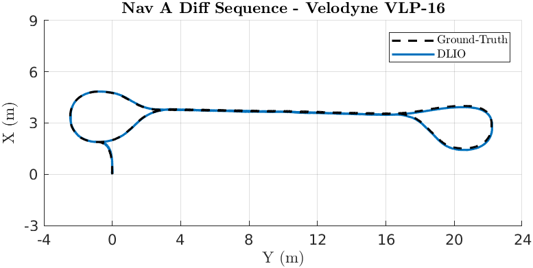

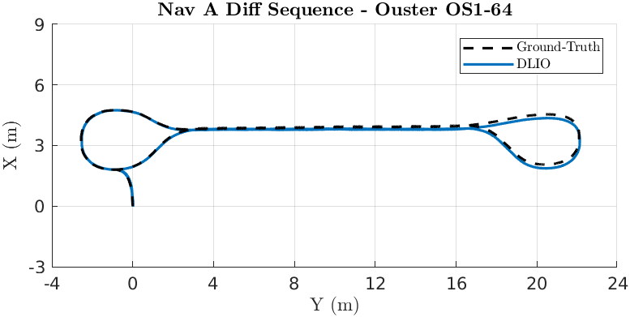

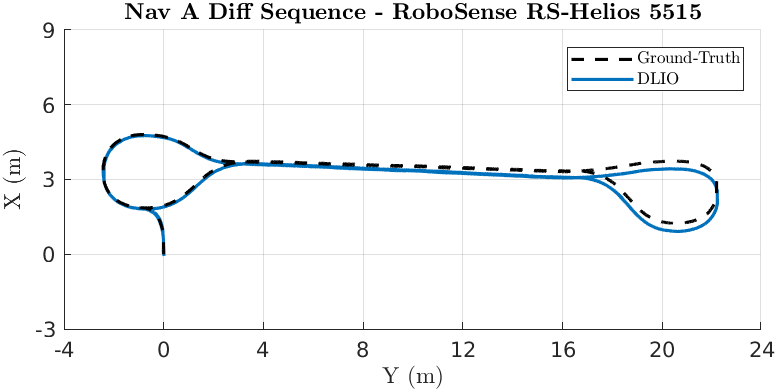

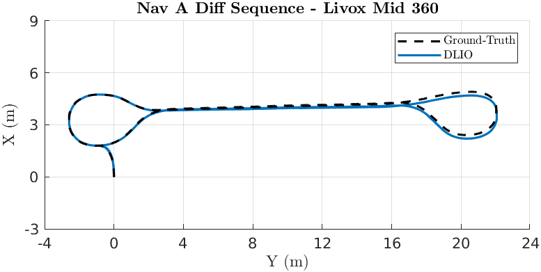

### Nav A Omni Sequence 

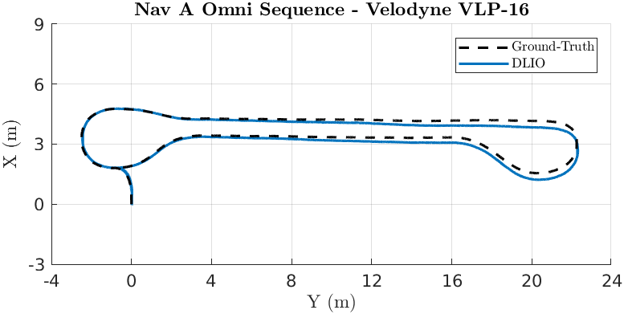

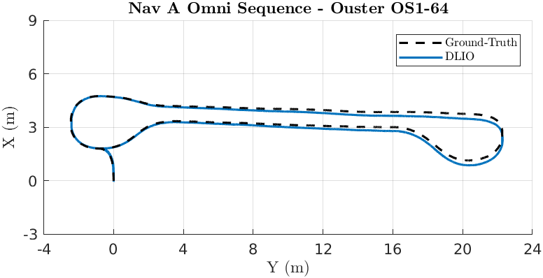

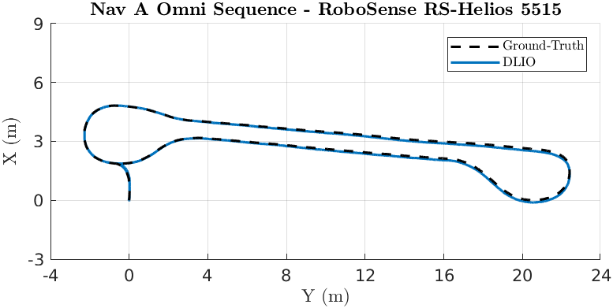

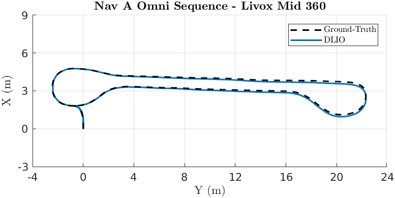

### Loop Sequence 

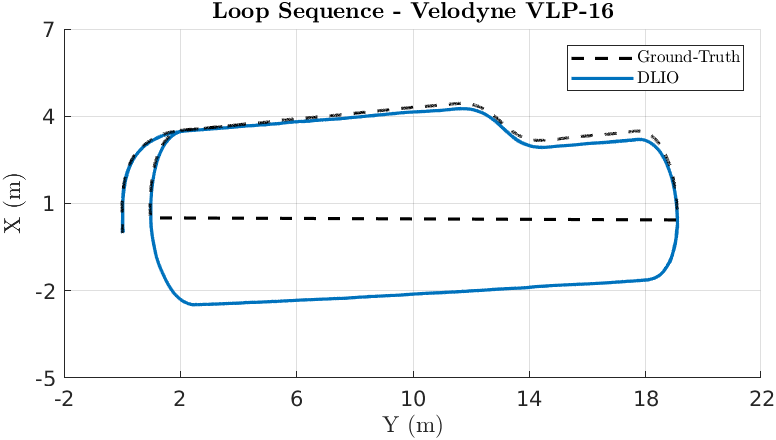

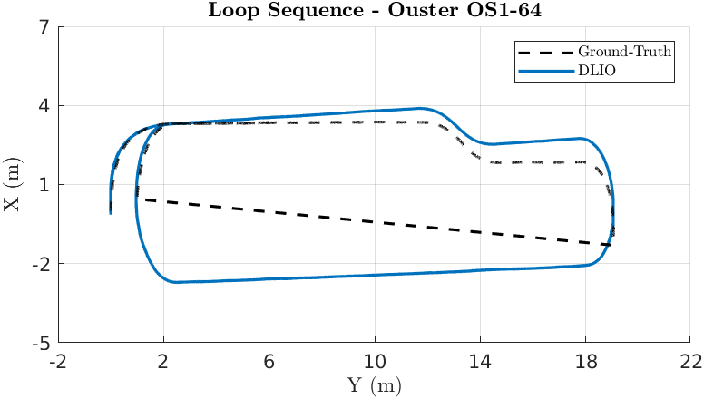

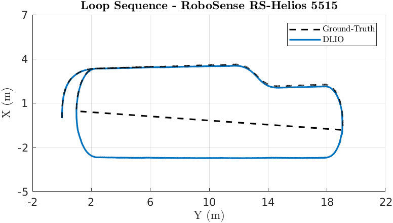

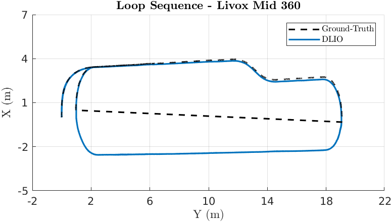

### Slippage Sequence 

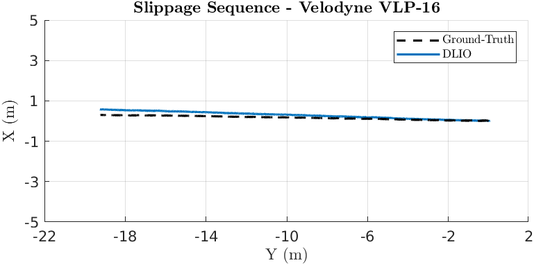

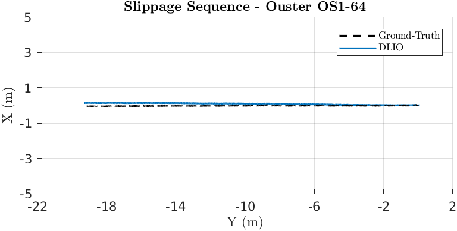

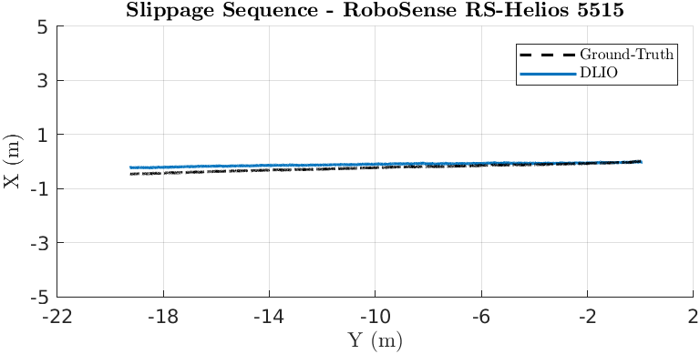

### Ramp Sequence 

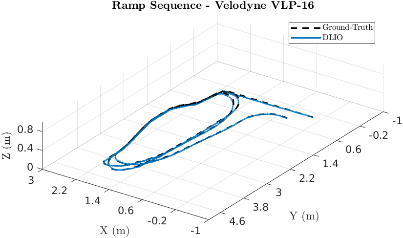

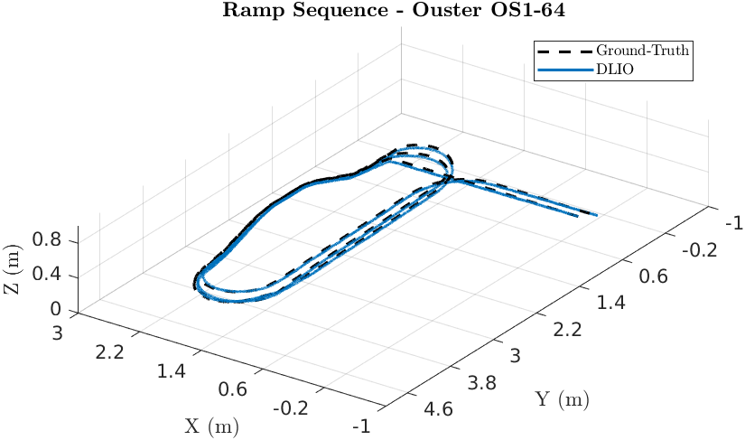

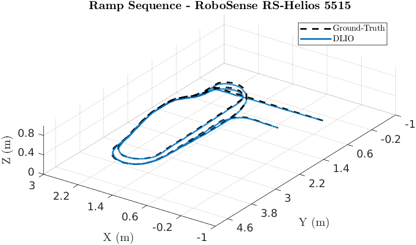

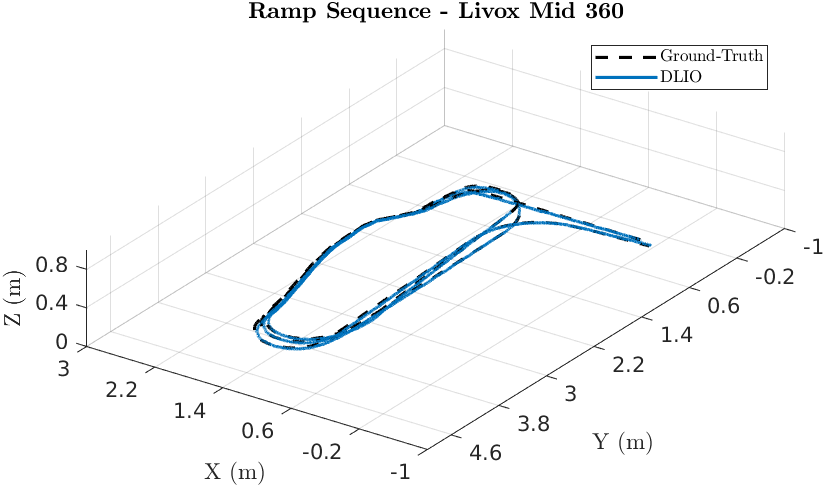

### Elevator Sequence 

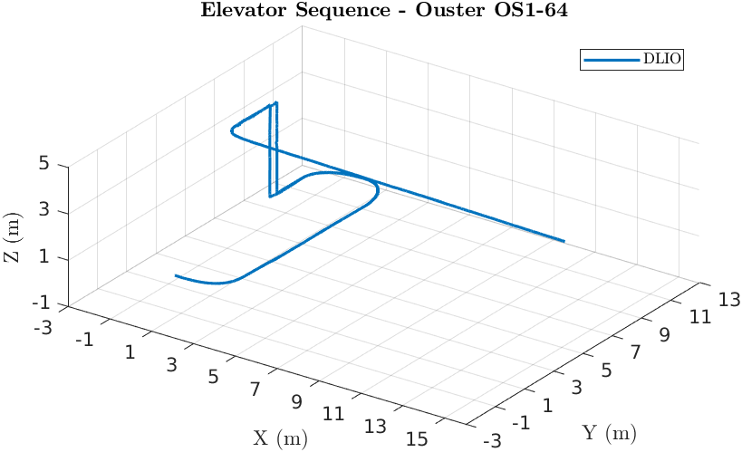

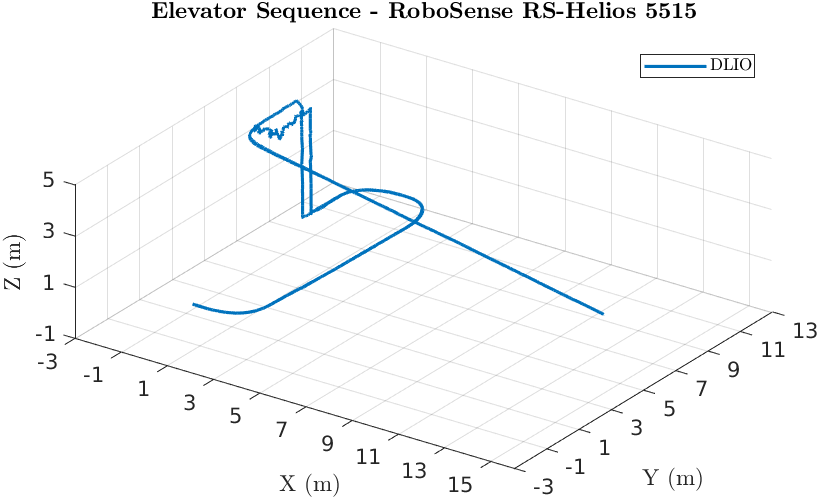

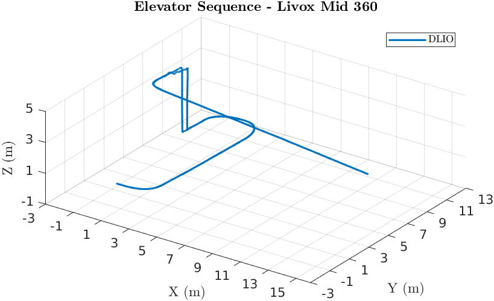

