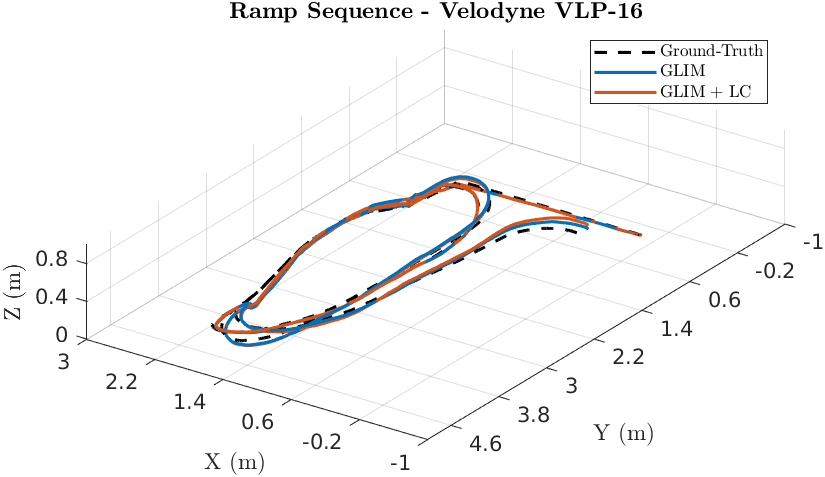
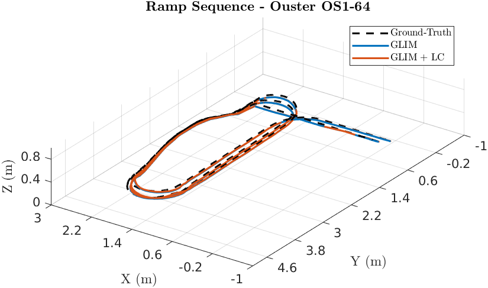
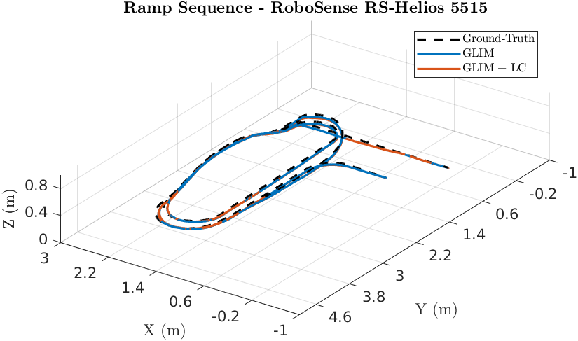
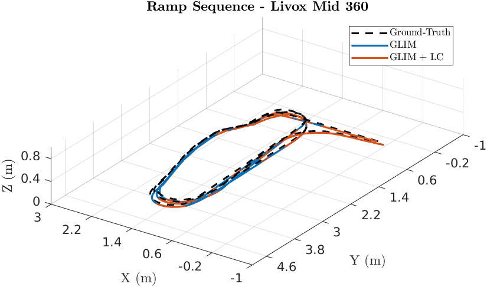

# GLIM

## Absolute Trajectory Error (ATE)

Root Mean Square Error (RMSE) of the absolute position differences. Values are presented in meters (m).

| 3D LiDAR Sensor              | Nav A Diff     | Nav A Omni     | Loop           | Slippage       | Ramp           |
| :--------------------------- | :------------: | :------------: | :------------: | :------------: | :------------: |
| **Velodyne VLP-16**          | 0.525 m        | 0.286 m        | 1.563 m        | 0.082 m        | 0.068 m        |
| **Ouster OS1-64**            | 0.029 m        | 0.021 m        | <u>0.034</u> m | 0.036 m        | <u>0.053</u> m |
| **RoboSense RS-Helios-5515** | 0.137 m        | 0.055 m        | 0.560 m        | 0.030 m        | 0.057 m        |
| **Livox Mid 360**            | <u>0.017</u> m | <u>0.016</u> m | 0.104 m        | <u>0.025</u> m | 0.057 m        |

## Relative Translational Error (RTE)

Mean value calculated over all 10-meter segments. Values are presented as a percentage (%).

| 3D LiDAR Sensor              | Nav A Diff   | Nav A Omni   | Loop         | Slippage     | Ramp         |
| :--------------------------- | :----------: | :----------: | :----------: | :----------: | :----------: |
| **Velodyne VLP-16**          | 2.99%        | 2.73%        | 18.69%       | 2.38%        | 0.82%        |
| **Ouster OS1-64**            | 1.15%        | 1.18%        | <u>1.17</u>% | 1.23%        | <u>0.34</u>% |
| **RoboSense RS-Helios-5515** | 1.60%        | 1.16%        | 7.36%        | 1.43%        | 0.65%        |
| **Livox Mid 360**            | <u>0.78</u>% | <u>0.81</u>% | 1.76%        | <u>0.82</u>% | 0.64%        |

## Relative Rotational Error (RRE)

Mean value calculated over all 10-meter segments. Values are presented in degrees per meter (°/m).

| 3D LiDAR Sensor              | Nav A Diff       | Nav A Omni       | Loop             | Slippage         | Ramp             |
| :--------------------------- | :--------------: | :--------------: | :--------------: | :--------------: | :--------------: |
| **Velodyne VLP-16**          | 0.048 °/m        | 0.046 °/m        | 0.083 °/m        | <u>0.036</u> °/m | 0.040 °/m        |
| **Ouster OS1-64**            | 0.066 °/m        | 0.075 °/m        | 0.058 °/m        | 0.074 °/m        | 0.050 °/m        |
| **RoboSense RS-Helios-5515** | 0.051 °/m        | <u>0.038</u> °/m | 0.049 °/m        | 0.038 °/m        | <u>0.036</u> °/m |
| **Livox Mid 360**            | <u>0.044</u> °/m | 0.052 °/m        | <u>0.036</u> °/m | 0.039 °/m        | 0.055 °/m        |

## Trajectory Plots

### Ramp Sequence 

