# Kinematic-ICP

## Absolute Trajectory Error (ATE)

Root Mean Square Error (RMSE) of the absolute position differences. Values are presented in meters (m).

| 3D LiDAR Sensor              | Nav A Diff     | Nav A Omni     | Loop           | Slippage       | Ramp           |
| :--------------------------- | :------------: | :------------: | :------------: | :------------: | :------------: |
| **Velodyne VLP-16**          | 0.183 m        | 0.180 m        | 0.147 m        | 0.676 m        | -              |
| **Ouster OS1-64**            | 0.510 m        | 0.191 m        | 0.152 m        | 0.788 m        | -              |
| **RoboSense RS-Helios-5515** | 0.337 m        | <u>0.178</u> m | 0.103 m        | 0.676 m        | -              |
| **Livox Mid 360**            | <u>0.085</u> m | 0.181 m        | <u>0.053</u> m | <u>0.584</u> m | -              |

## Relative Translational Error (RTE)

Mean value calculated over all 10-meter segments. Values are presented as a percentage (%).

| 3D LiDAR Sensor              | Nav A Diff   | Nav A Omni   | Loop         | Slippage     | Ramp         |
| :--------------------------- | :----------: | :----------: | :----------: | :----------: | :----------: |
| **Velodyne VLP-16**          | 2.43%        | 2.45%        | 1.96%        | 8.63%        | -            |
| **Ouster OS1-64**            | 3.18%        | 2.59%        | 1.95%        | 9.94%        | -            |
| **RoboSense RS-Helios-5515** | 2.87%        | <u>2.27</u>% | 1.62%        | 8.86%        | -            |
| **Livox Mid 360**            | <u>1.62</u>% | 2.31%        | <u>1.38</u>% | <u>7.45</u>% | -            |

## Relative Rotational Error (RRE)

Mean value calculated over all 10-meter segments. Values are presented in degrees per meter (°/m).

| 3D LiDAR Sensor              | Nav A Diff       | Nav A Omni       | Loop             | Slippage         | Ramp             |
| :--------------------------- | :--------------: | :--------------: | :--------------: | :--------------: | :--------------: |
| **Velodyne VLP-16**          | 0.140 °/m        | 0.152 °/m        | 0.137 °/m        | <u>0.093</u> °/m | -                |
| **Ouster OS1-64**            | 0.224 °/m        | 0.172 °/m        | 0.137 °/m        | 0.135 °/m        | -                |
| **RoboSense RS-Helios-5515** | 0.184 °/m        | 0.143 °/m        | 0.118 °/m        | 0.110 °/m        | -                |
| **Livox Mid 360**            | <u>0.066</u> °/m | <u>0.108</u> °/m | <u>0.084</u> °/m | 0.106 °/m        | -                |

## Trajectory Plots

### Nav A Diff Sequence 

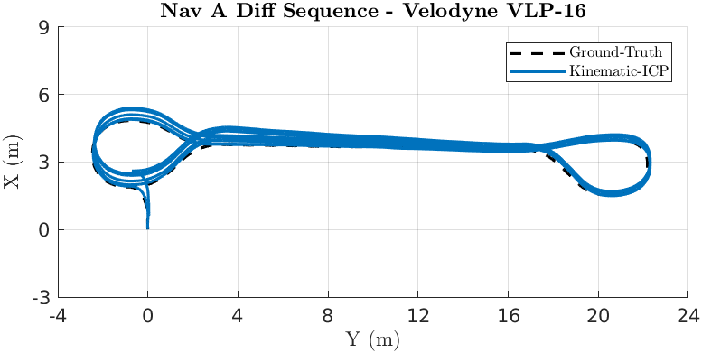

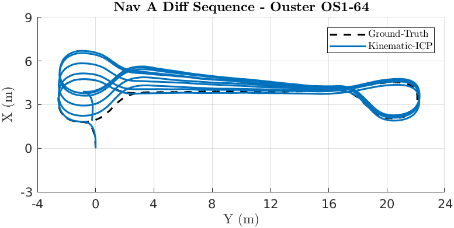

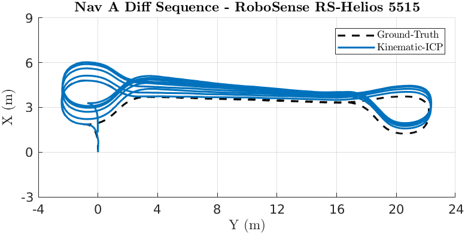

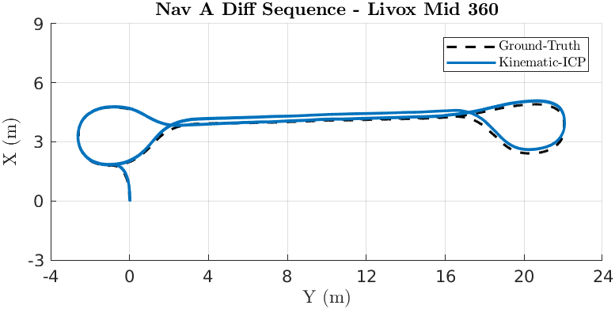

### Nav A Omni Sequence 

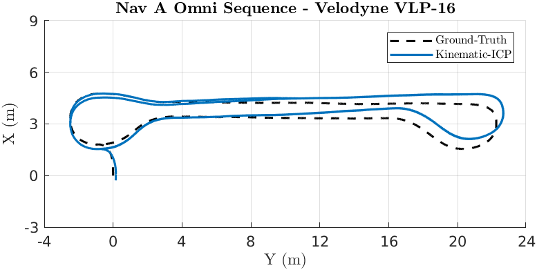

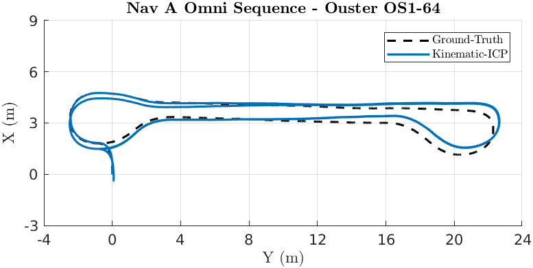

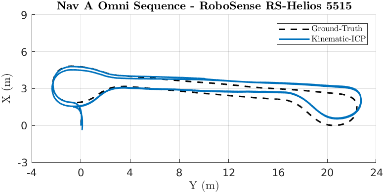

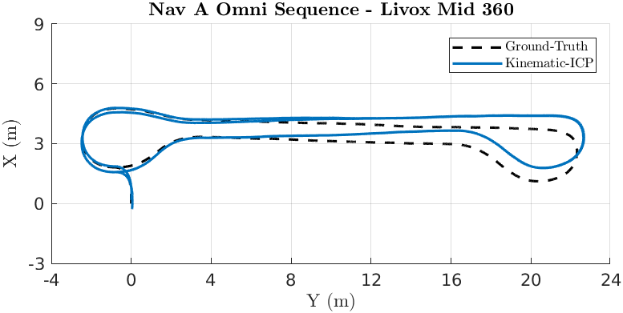

### Loop Sequence 

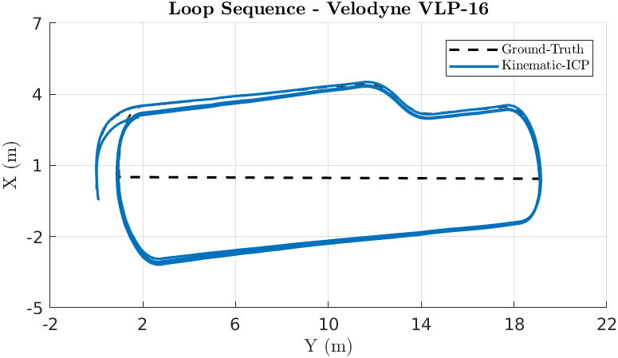

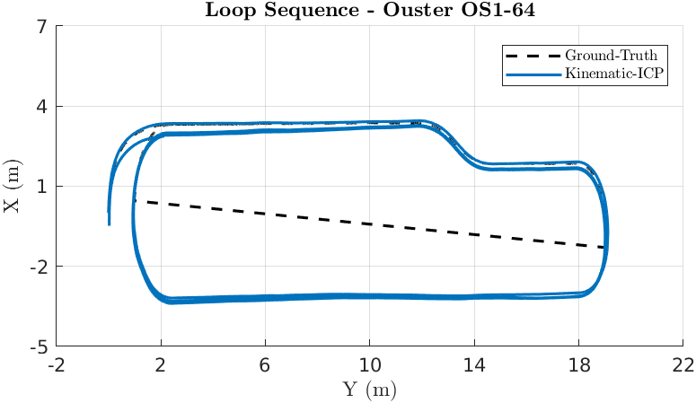

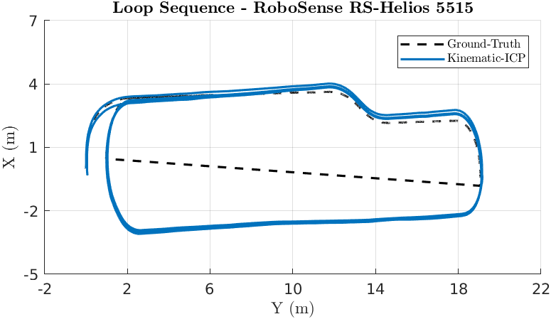

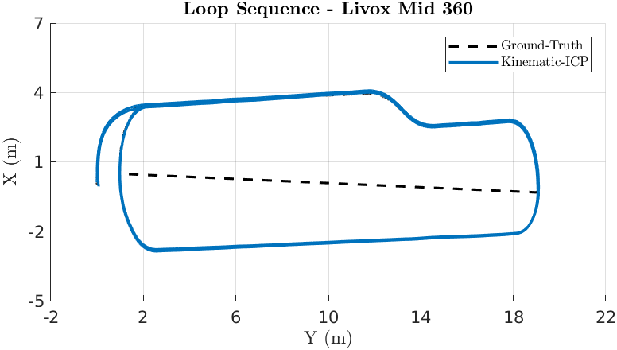

### Slippage Sequence 

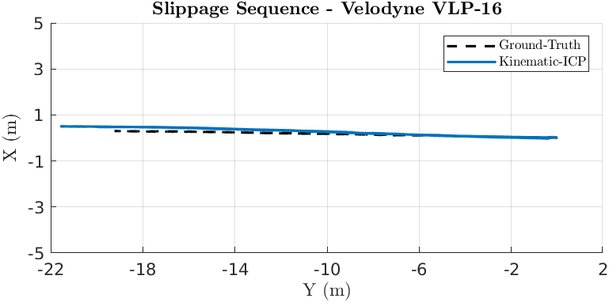

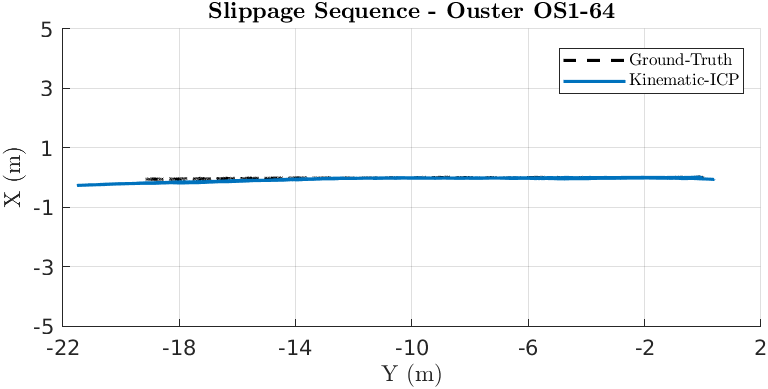

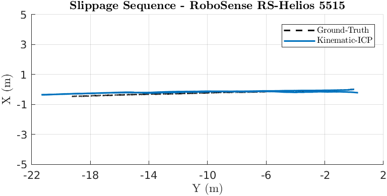

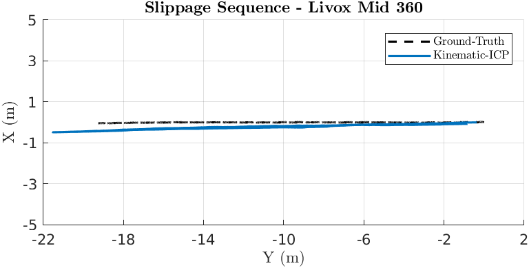

### Ramp Sequence 

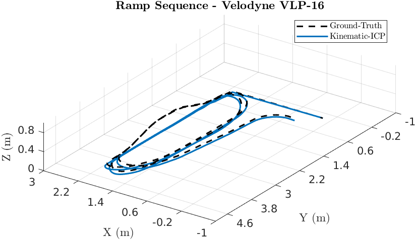

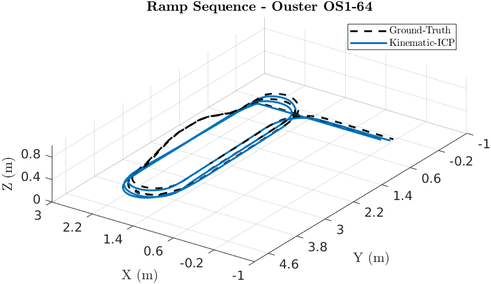

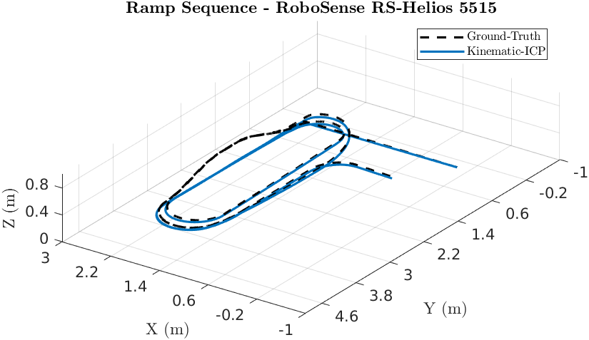

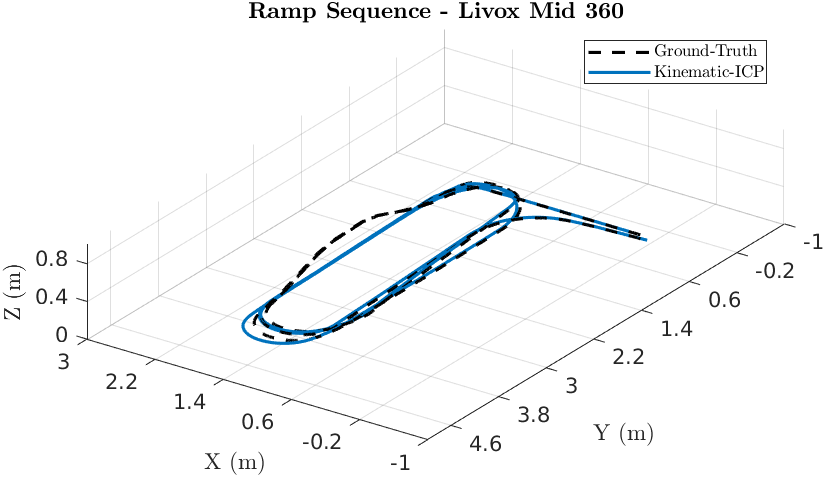

### Elevator Sequence 

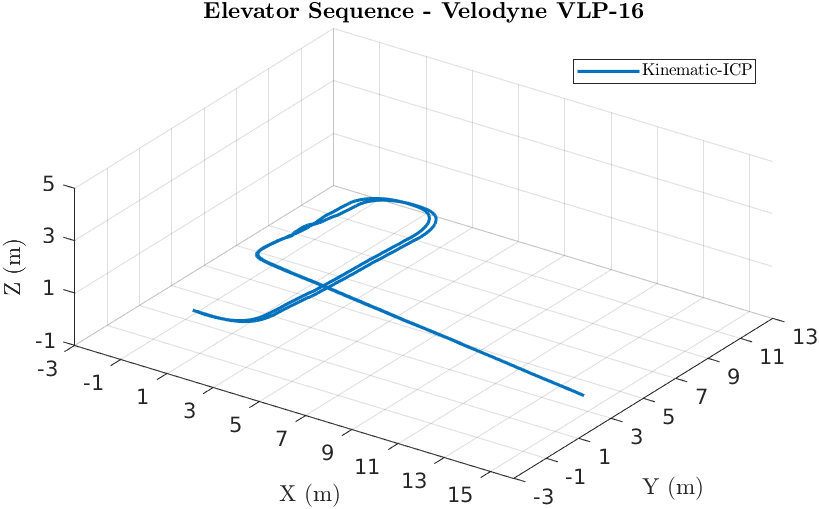

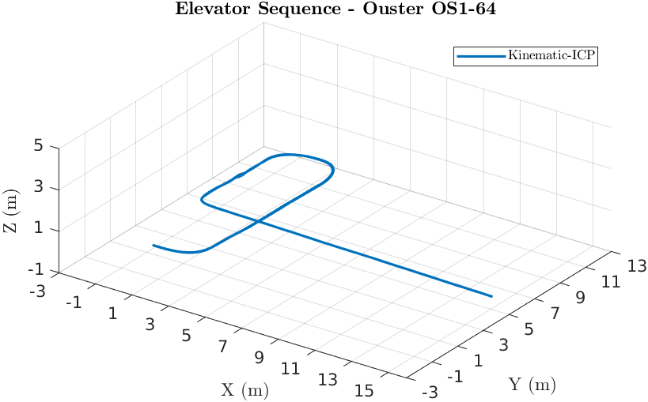

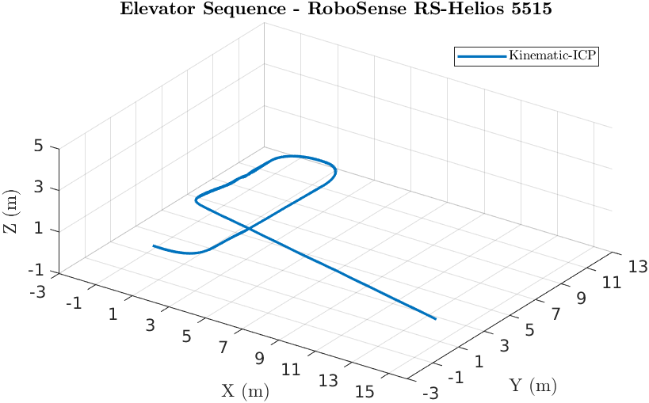

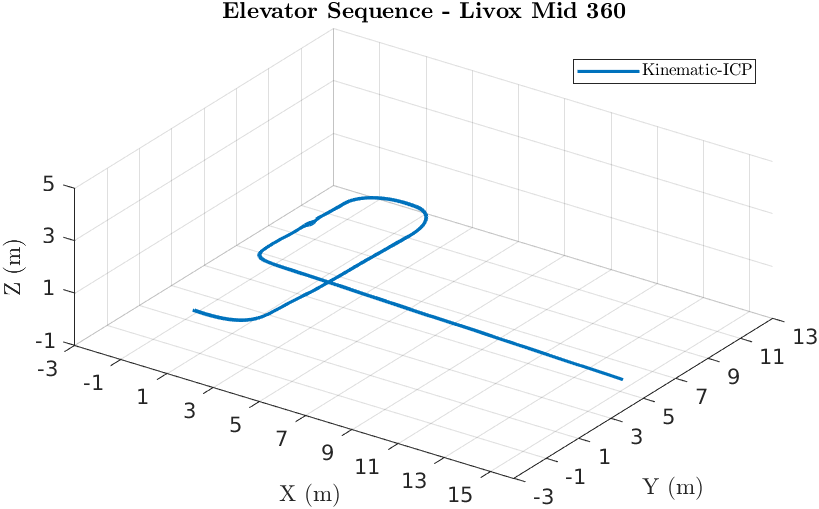

