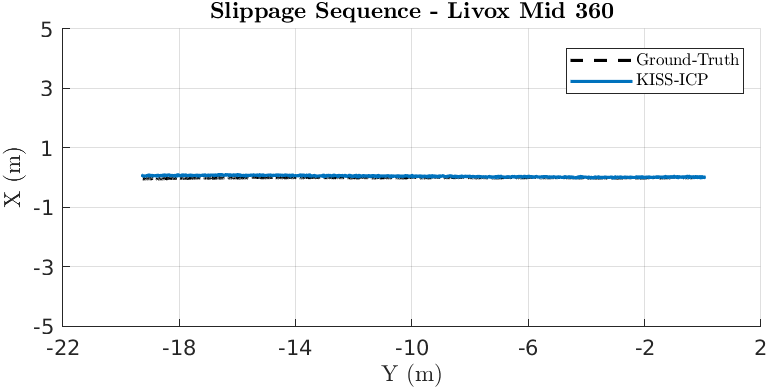
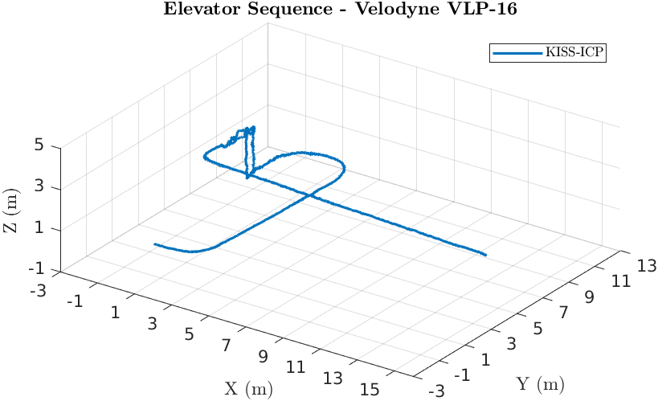

# KISS-ICP

## Absolute Trajectory Error (ATE)

Root Mean Square Error (RMSE) of the absolute position differences. Values are presented in meters (m).

| 3D LiDAR Sensor              | Nav A Diff     | Nav A Omni     | Loop           | Slippage       | Ramp           |
| :--------------------------- | :------------: | :------------: | :------------: | :------------: | :------------: |
| **Velodyne VLP-16**          | 0.052 m        | 0.047 m        | 0.045 m        | 0.045 m        | 0.041 m        |
| **Ouster OS1-64**            | 0.036 m        | 0.038 m        | 0.032 m        | 0.035 m        | 0.030 m        |
| **RoboSense RS-Helios-5515** | 0.046 m        | 0.046 m        | 0.047 m        | 0.041 m        | 0.039 m        |
| **Livox Mid-360**            | <u>0.031</u> m | <u>0.030</u> m | <u>0.026</u> m | <u>0.033</u> m | <u>0.028</u> m |

## Relative Translational Error (RTE)

Mean value calculated over all 10-meter segments. Values are presented as a percentage (%).

| 3D LiDAR Sensor              | Nav A Diff   | Nav A Omni   | Loop         | Slippage     | Ramp         |
| :--------------------------- | :----------: | :----------: | :----------: | :----------: | :----------: |
| **Velodyne VLP-16**          | 1.41%        | 1.38%        | 1.50%        | 1.56%        | 0.91%        |
| **Ouster OS1-64**            | 1.07%        | 1.10%        | 1.00%        | 1.12%        | 0.64%        |
| **RoboSense RS-Helios-5515** | 1.10%        | 1.10%        | 1.00%        | 0.96%        | 0.58%        |
| **Livox Mid-360**            | <u>0.76</u>% | <u>0.75</u>% | <u>0.83</u>% | <u>0.95</u>% | <u>0.53</u>% |

## Relative Rotational Error (RRE)

Mean value calculated over all 10-meter segments. Values are presented in degrees per meter (°/m).

| 3D LiDAR Sensor              | Nav A Diff       | Nav A Omni       | Loop             | Slippage         | Ramp             |
| :--------------------------- | :--------------: | :--------------: | :--------------: | :--------------: | :--------------: |
| **Velodyne VLP-16**          | 0.093 °/m        | 0.091 °/m        | 0.096 °/m        | 0.088 °/m        | 0.149 °/m        |
| **Ouster OS1-64**            | 0.073 °/m        | 0.079 °/m        | 0.063 °/m        | 0.069 °/m        | <u>0.087</u> °/m |
| **RoboSense RS-Helios-5515** | 0.091 °/m        | 0.080 °/m        | 0.098 °/m        | 0.081 °/m        | 0.125 °/m        |
| **Livox Mid-360**            | <u>0.064</u> °/m | <u>0.067</u> °/m | <u>0.059</u> °/m | <u>0.052</u> °/m | 0.099 °/m        |

## Trajectory Plots

### Nav A Diff Sequence 

### Nav A Omni Sequence 

### Loop Sequence 

### Slippage Sequence 

### Ramp Sequence 

### Elevator Sequence 

