# LeGO-LOAM-BOR

## Absolute Trajectory Error (ATE)

Root Mean Square Error (RMSE) of the absolute position differences. Values are presented in meters (m).

| 3D LiDAR Sensor              | Nav A Diff     | Nav A Omni     | Loop           | Slippage       | Ramp           |
| :--------------------------- | :------------: | :------------: | :------------: | :------------: | :------------: |
| **Velodyne VLP-16**          | 0.054 m        | 0.047 m        | 0.042 m        | 0.053 m        | 0.050 m        |
| **Ouster OS1-64**            | 0.042 m        | <u>0.036</u> m | <u>0.033</u> m | 0.045 m        | <u>0.036</u> m |
| **RoboSense RS-Helios-5515** | <u>0.040</u> m | 0.038 m        | 0.039 m        | <u>0.043</u> m | 0.041 m        |
| **Livox Mid 360**            | -              | -              | -              | -              | -              |

## Relative Translational Error (RTE)

Mean value calculated over all 10-meter segments. Values are presented as a percentage (%).

| 3D LiDAR Sensor              | Nav A Diff   | Nav A Omni   | Loop         | Slippage     | Ramp         |
| :--------------------------- | :----------: | :----------: | :----------: | :----------: | :----------: |
| **Velodyne VLP-16**          | 1.33%        | 1.43%        | 1.67%        | 1.87%        | 0.75%        |
| **Ouster OS1-64**            | <u>1.14</u>% | <u>1.23</u>% | 1.43%        | <u>1.44</u>% | <u>0.52</u>% |
| **RoboSense RS-Helios-5515** | 1.45%        | 1.29%        | <u>1.37</u>% | 1.71%        | 0.59%        |
| **Livox Mid 360**            | -            | -            | -            | -            | -            |

## Relative Rotational Error (RRE)

Mean value calculated over all 10-meter segments. Values are presented in degrees per meter (°/m).

| 3D LiDAR Sensor              | Nav A Diff       | Nav A Omni       | Loop             | Slippage         | Ramp             |
| :--------------------------- | :--------------: | :--------------: | :--------------: | :--------------: | :--------------: |
| **Velodyne VLP-16**          | 0.114 °/m        | 0.110 °/m        | 0.119 °/m        | 0.151 °/m        | 0.189 °/m        |
| **Ouster OS1-64**            | <u>0.097</u> °/m | 0.106 °/m        | <u>0.083</u> °/m | <u>0.104</u> °/m | <u>0.150</u> °/m |
| **RoboSense RS-Helios-5515** | 0.114 °/m        | <u>0.104</u> °/m | 0.132 °/m        | 0.114 °/m        | 0.168 °/m        |
| **Livox Mid 360**            | -                | -                | -                | -                | -                |

## Trajectory Plots

### Nav A Diff Sequence 

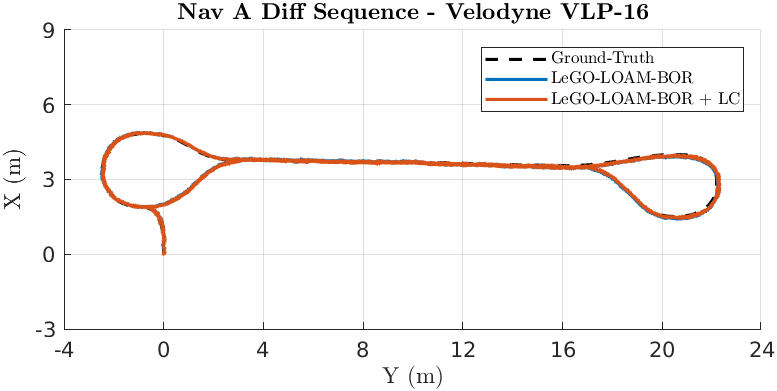

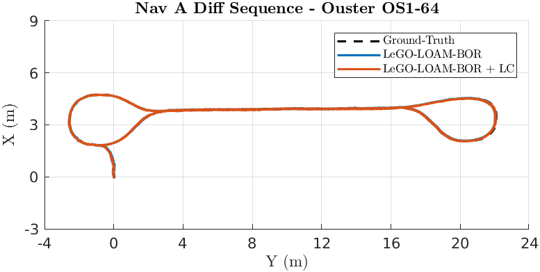

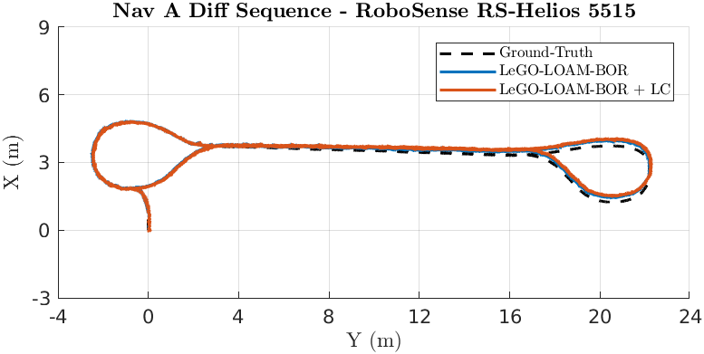

### Nav A Omni Sequence 

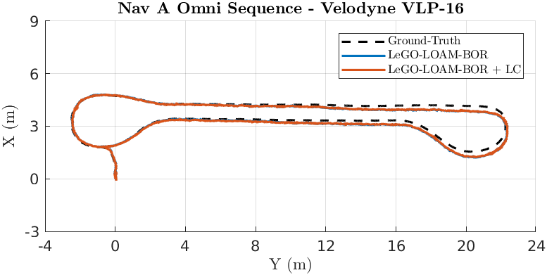

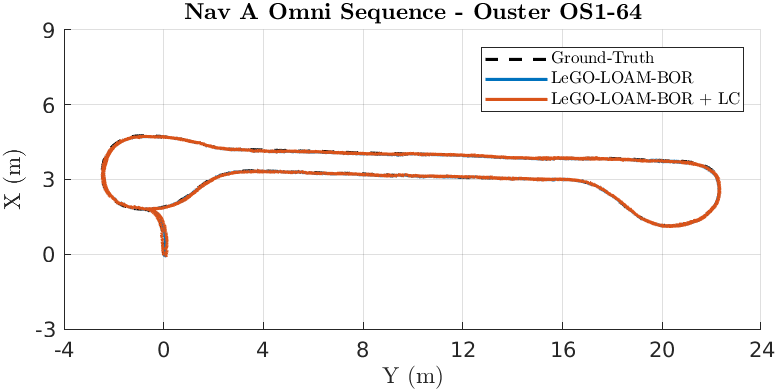

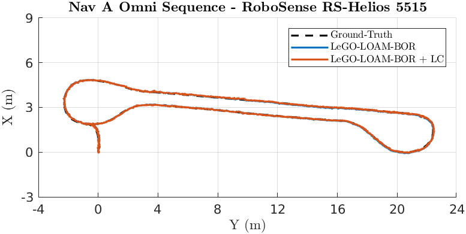

### Loop Sequence 

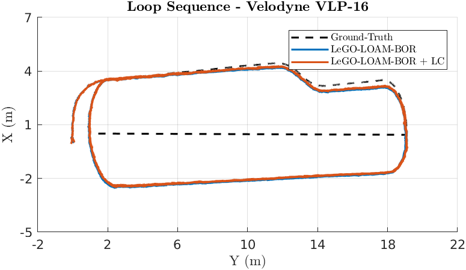

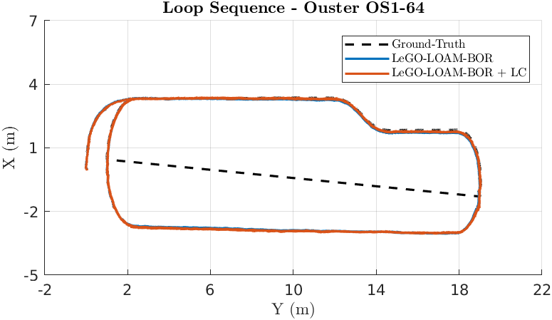

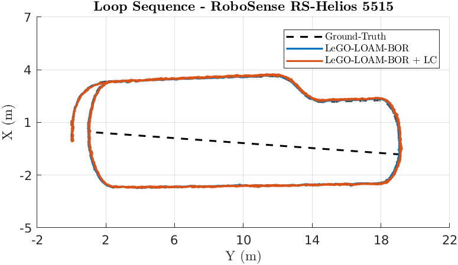

### Slippage Sequence 

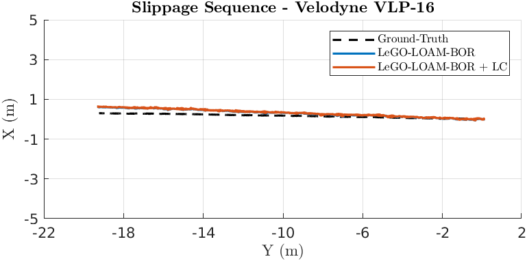

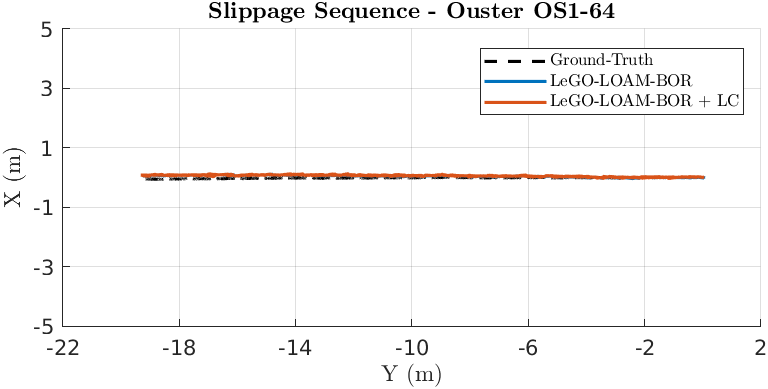

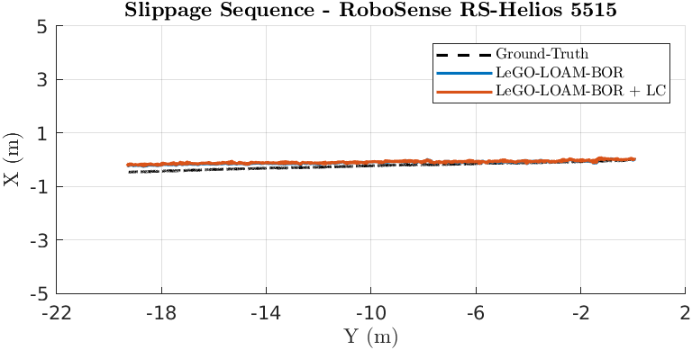

### Ramp Sequence 

### Elevator Sequence 

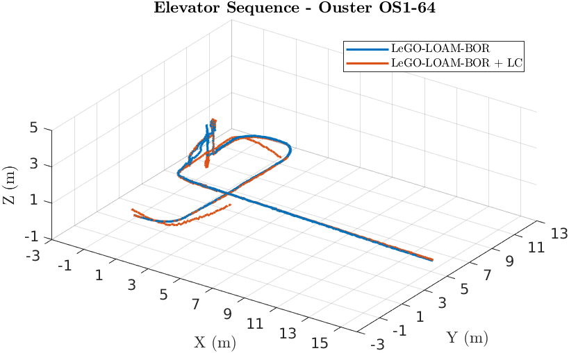

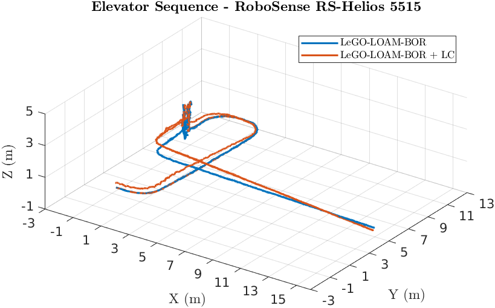

