# LIORF

## Absolute Trajectory Error (ATE)

Root Mean Square Error (RMSE) of the absolute position differences. Values are presented in meters (m).

| 3D LiDAR Sensor              | Nav A Diff     | Nav A Omni     | Loop           | Slippage       | Ramp           |
| :--------------------------- | :------------: | :------------: | :------------: | :------------: | :------------: |
| **Velodyne VLP-16**          | 0.030 m        | 0.027 m        | 0.025 m        | 0.035 m        | 0.030 m        |
| **Ouster OS1-64**            | 0.032 m        | 0.031 m        | <u>0.021</u> m | <u>0.028</u> m | <u>0.017</u> m |
| **RoboSense RS-Helios-5515** | <u>0.029</u> m | <u>0.024</u> m | 0.023 m        | 0.029 m        | 0.034 m        |
| **Livox Mid 360**            | -              | -              | -              | -              | -              |

## Relative Translational Error (RTE)

Mean value calculated over all 10-meter segments. Values are presented as a percentage (%).

| 3D LiDAR Sensor              | Nav A Diff   | Nav A Omni   | Loop         | Slippage     | Ramp         |
| :--------------------------- | :----------: | :----------: | :----------: | :----------: | :----------: |
| **Velodyne VLP-16**          | 1.33%        | 1.43%        | 1.63%        | 1.40%        | 0.36%        |
| **Ouster OS1-64**            | <u>1.06</u>% | <u>1.24</u>% | 1.31%        | 1.19%        | <u>0.21</u>% |
| **RoboSense RS-Helios-5515** | 1.23%        | <u>1.24</u>% | <u>1.28</u>% | <u>0.97</u>% | 0.47%        |
| **Livox Mid 360**            | -            | -            | -            | -            | -            |

## Relative Rotational Error (RRE)

Mean value calculated over all 10-meter segments. Values are presented in degrees per meter (°/m).

| 3D LiDAR Sensor              | Nav A Diff       | Nav A Omni       | Loop             | Slippage         | Ramp             |
| :--------------------------- | :--------------: | :--------------: | :--------------: | :--------------: | :--------------: |
| **Velodyne VLP-16**          | <u>0.057</u> °/m | <u>0.064</u> °/m | 0.086 °/m        | 0.084 °/m        | 0.078 °/m        |
| **Ouster OS1-64**            | 0.060 °/m        | 0.070 °/m        | <u>0.055</u> °/m | <u>0.057</u> °/m | <u>0.026</u> °/m |
| **RoboSense RS-Helios-5515** | 0.090 °/m        | 0.109 °/m        | 0.093 °/m        | 0.077 °/m        | 0.119 °/m        |
| **Livox Mid 360**            | -                | -                | -                | -                | -                |

## Trajectory Plots

### Nav A Diff Sequence 

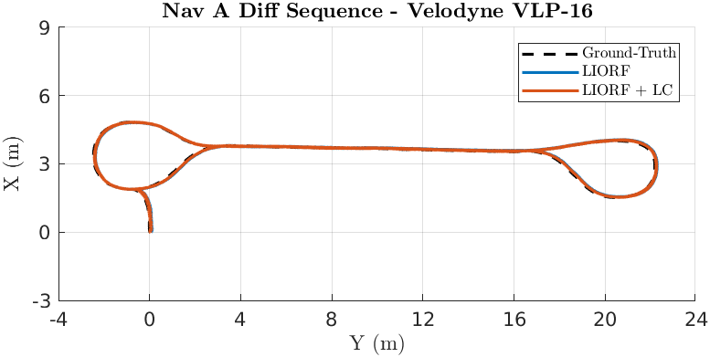

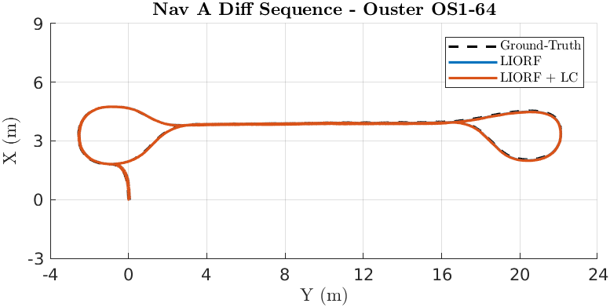

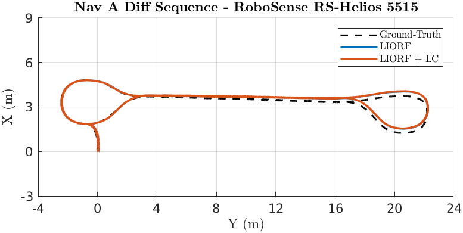

### Nav A Omni Sequence 

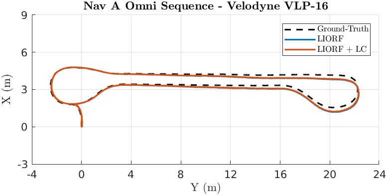

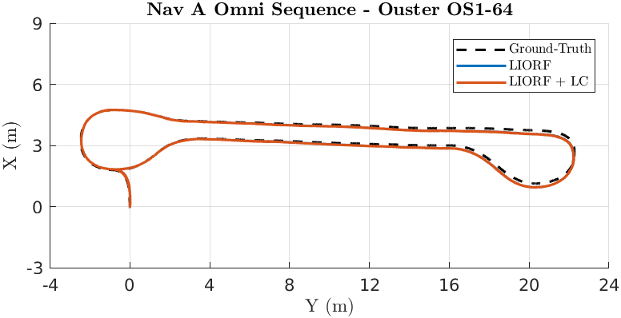

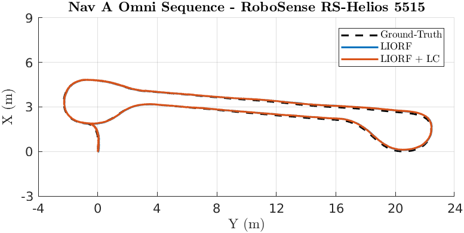

### Loop Sequence 

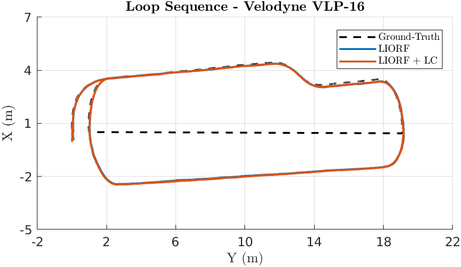

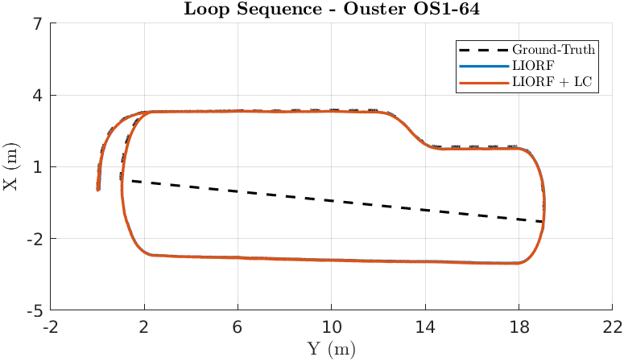

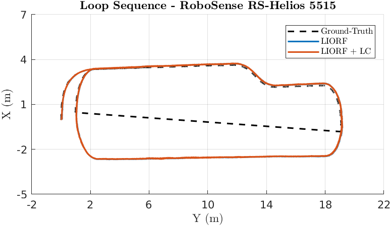

### Slippage Sequence 

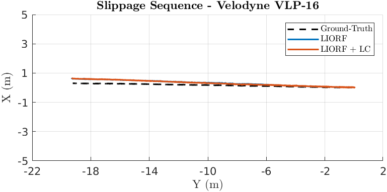

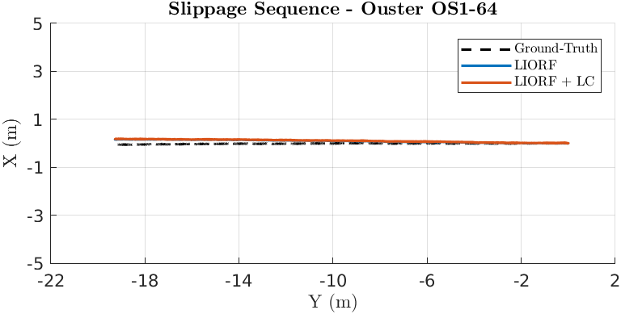

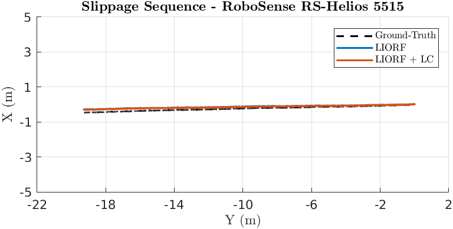

### Ramp Sequence 

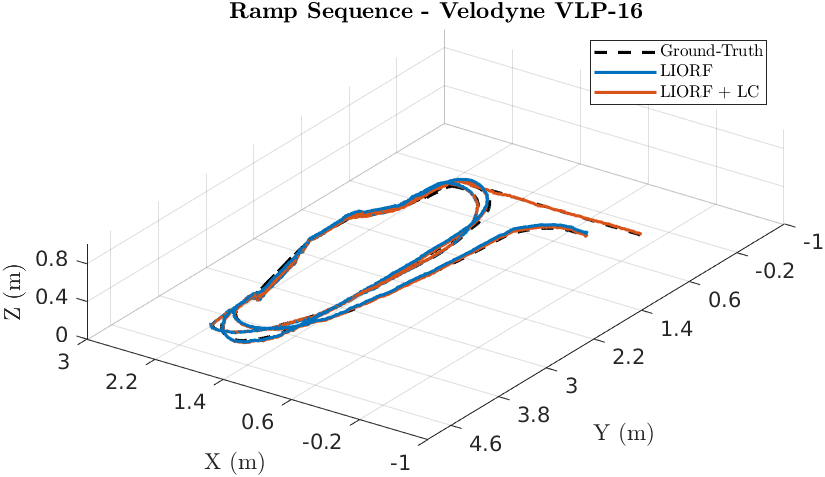

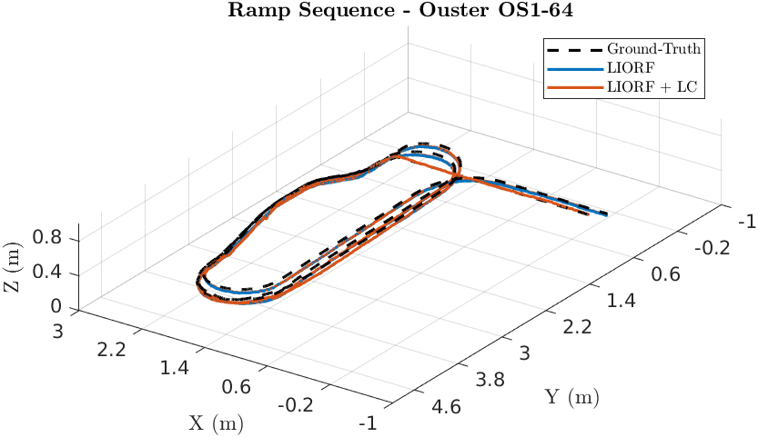

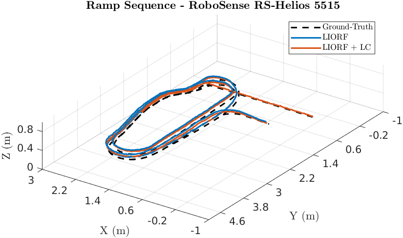

### Elevator Sequence 

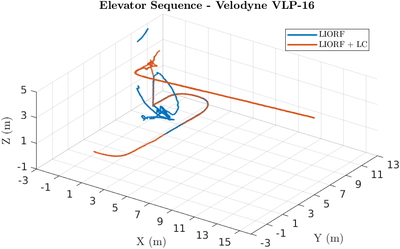

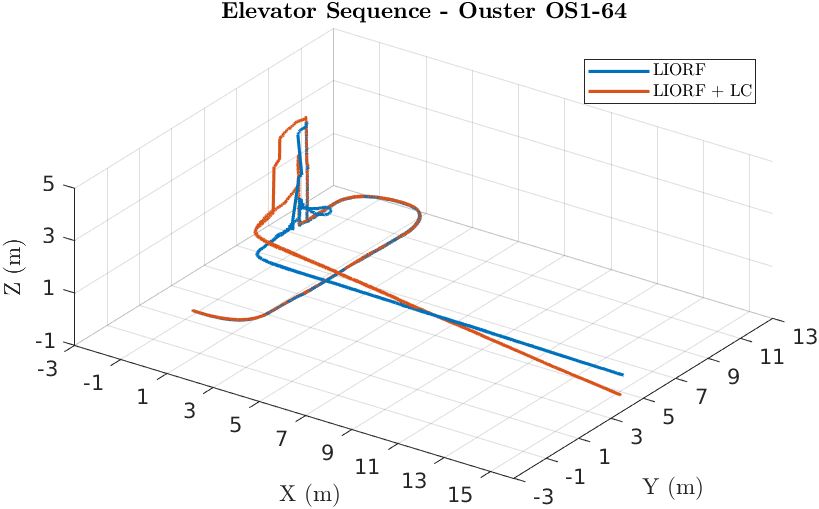

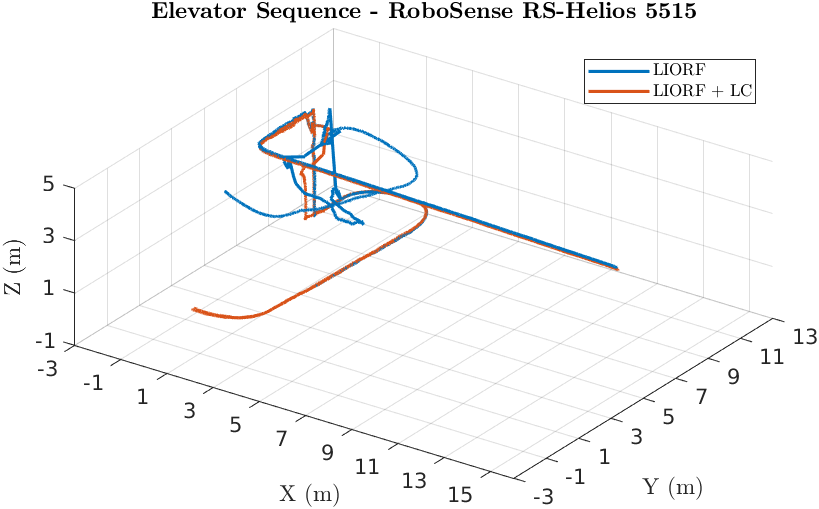

