# VineSLAM

## Absolute Trajectory Error (ATE)

Root Mean Square Error (RMSE) of the absolute position differences. Values are presented in meters (m).

| 3D LiDAR Sensor              | Nav A Diff     | Nav A Omni     | Loop           | Slippage       | Ramp           |
| :--------------------------- | :------------: | :------------: | :------------: | :------------: | :------------: |
| **Velodyne VLP-16**          | <u>0.083</u> m | 0.089 m        | 0.128 m        | <u>0.077</u> m | <u>0.048</u> m |
| **Ouster OS1-64**            | 0.144 m        | 0.139 m        | 0.143 m        | 0.147 m        | 0.086 m        |
| **RoboSense RS-Helios-5515** | 0.108 m        | <u>0.078</u> m | <u>0.123</u> m | 0.095 m        | 0.056 m        |
| **Livox Mid-360**            | 0.188 m        | 0.106 m        | 0.124 m        | 0.096 m        | 0.108 m        |

## Relative Translational Error (RTE)

Mean value calculated over all 10-meter segments. Values are presented as a percentage (%).

| 3D LiDAR Sensor              | Nav A Diff   | Nav A Omni   | Loop         | Slippage     | Ramp         |
| :--------------------------- | :----------: | :----------: | :----------: | :----------: | :----------: |
| **Velodyne VLP-16**          | 2.03%        | 2.00%        | 2.24%        | 2.18%        | <u>0.62</u>% |
| **Ouster OS1-64**            | 2.61%        | 2.86%        | 2.83%        | 2.57%        | 1.08%        |
| **RoboSense RS-Helios-5515** | <u>2.00</u>% | 1.97%        | 2.55%        | 1.67%        | 0.80%        |
| **Livox Mid-360**            | 2.70%        | <u>1.95</u>% | <u>2.07</u>% | <u>1.56</u>% | 1.12%        |

## Relative Rotational Error (RRE)

Mean value calculated over all 10-meter segments. Values are presented in degrees per meter (°/m).

| 3D LiDAR Sensor              | Nav A Diff       | Nav A Omni       | Loop             | Slippage         | Ramp             |
| :--------------------------- | :--------------: | :--------------: | :--------------: | :--------------: | :--------------: |
| **Velodyne VLP-16**          | <u>0.147</u> °/m | <u>0.166</u> °/m | 0.182 °/m        | 0.148 °/m        | <u>0.283</u> °/m |
| **Ouster OS1-64**            | 0.201 °/m        | 0.242 °/m        | 0.251 °/m        | 0.153 °/m        | 0.369 °/m        |
| **RoboSense RS-Helios-5515** | 0.148 °/m        | 0.177 °/m        | 0.199 °/m        | 0.111 °/m        | 0.315 °/m        |
| **Livox Mid-360**            | 0.223 °/m        | 0.188 °/m        | <u>0.146</u> °/m | <u>0.072</u> °/m | 0.335 °/m        |

## Trajectory Plots

### Nav A Diff Sequence 

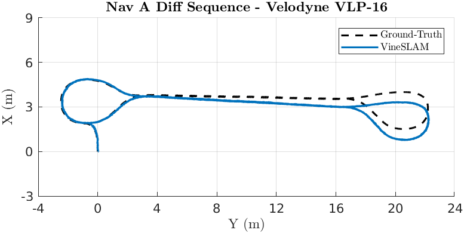

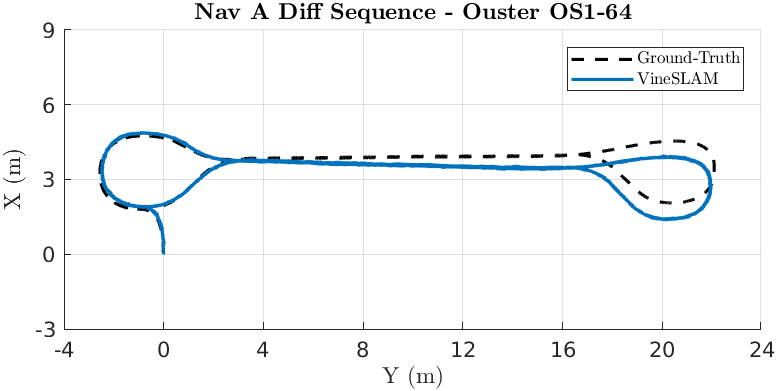

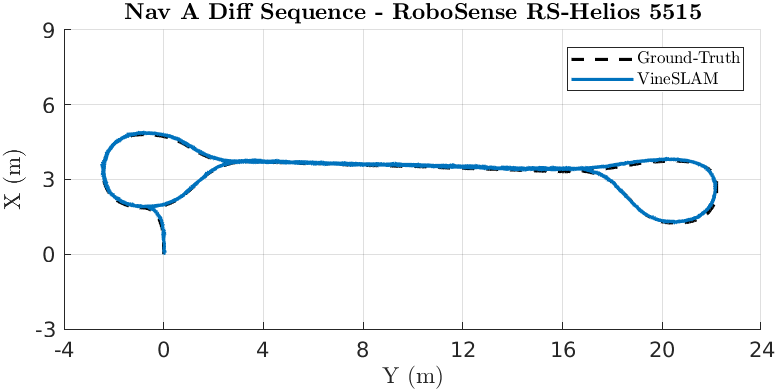

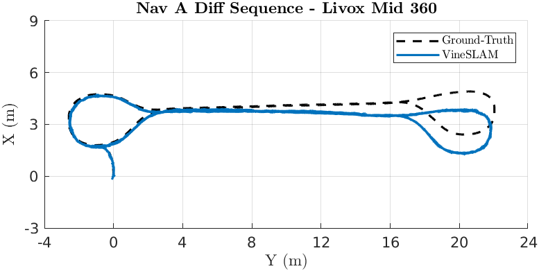

### Nav A Omni Sequence 

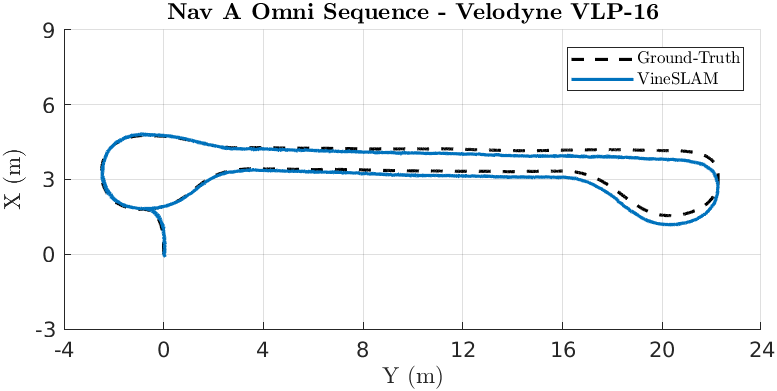

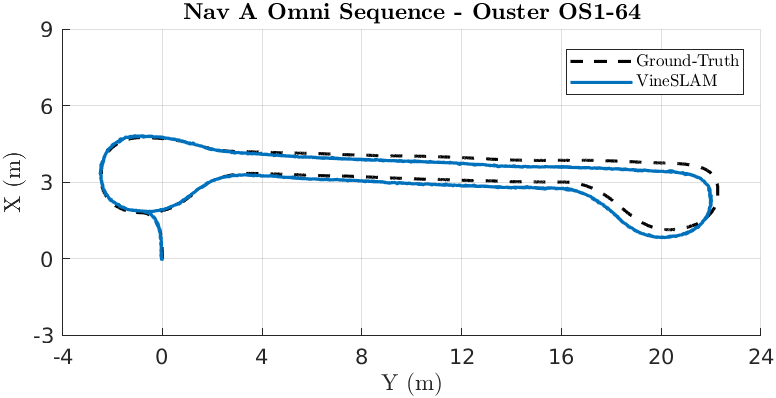

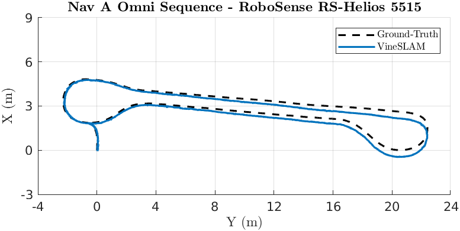

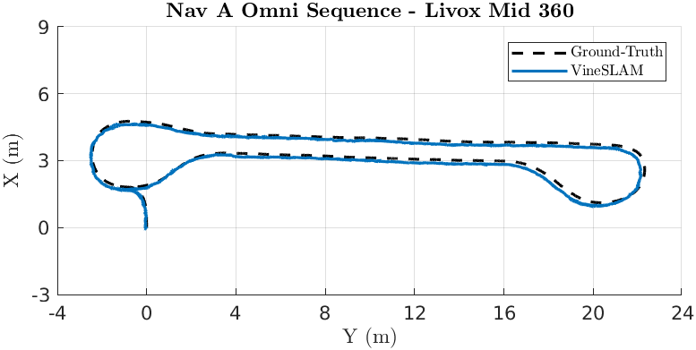

### Loop Sequence 

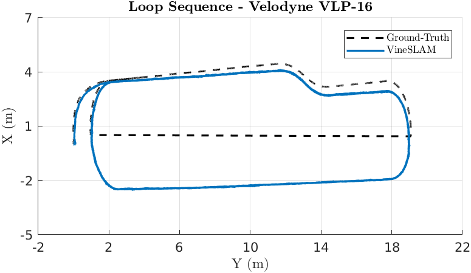

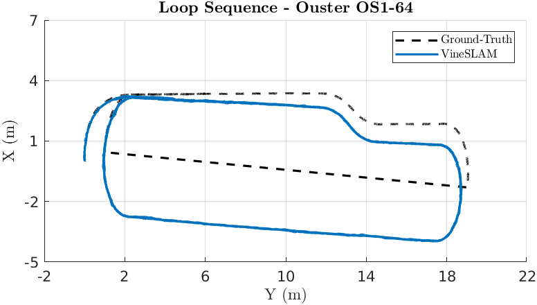

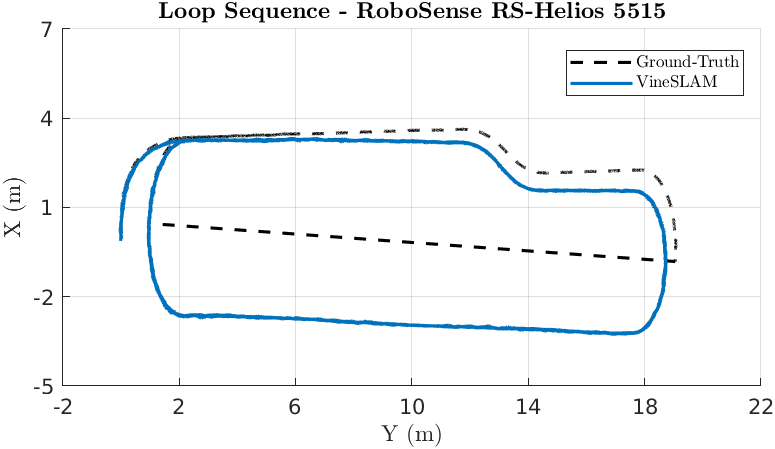

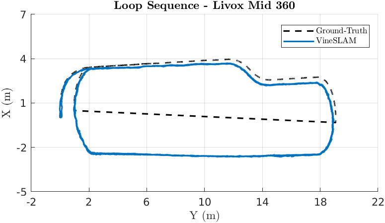

### Slippage Sequence 

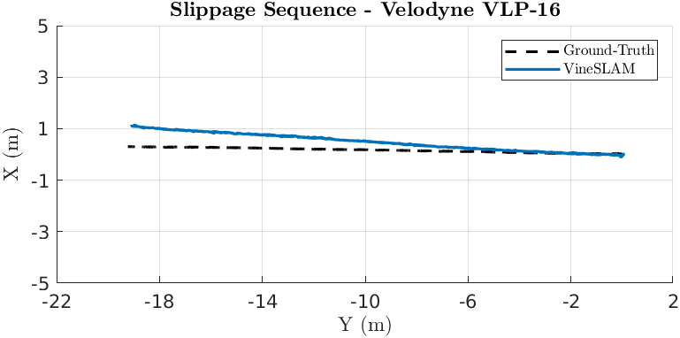

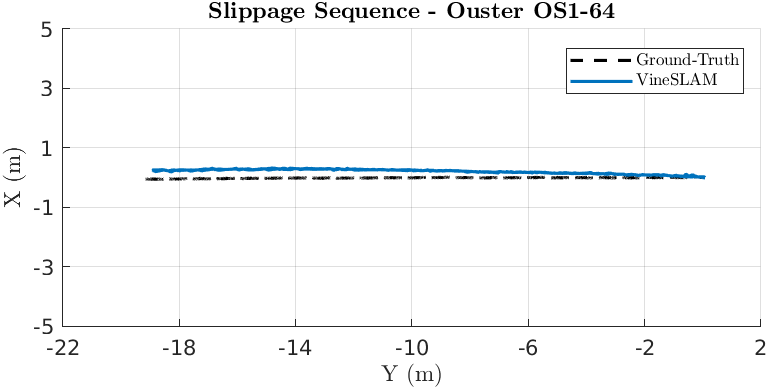

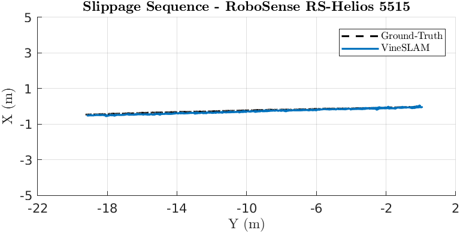

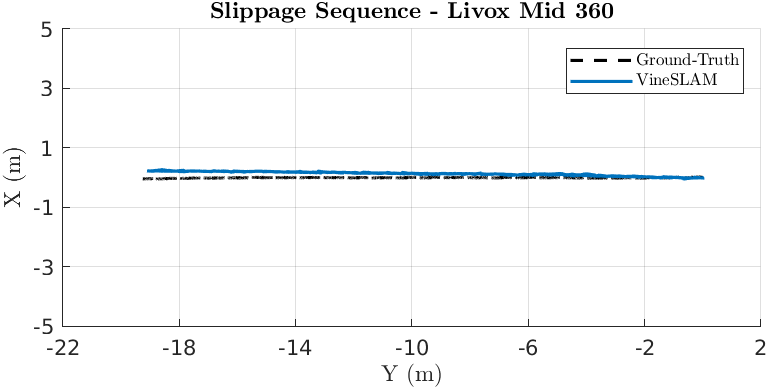

### Ramp Sequence 

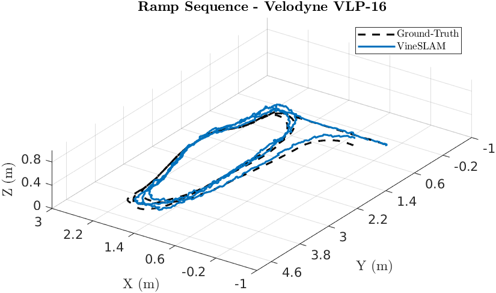

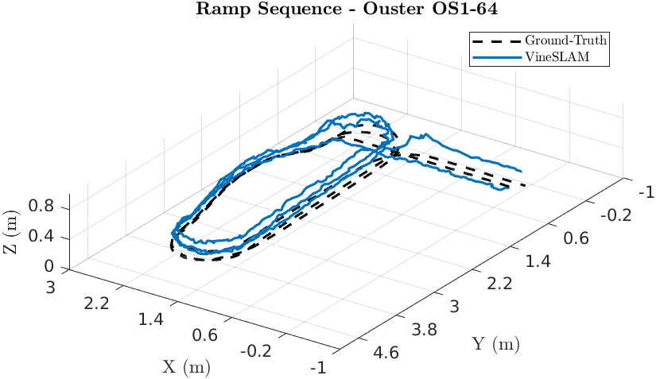

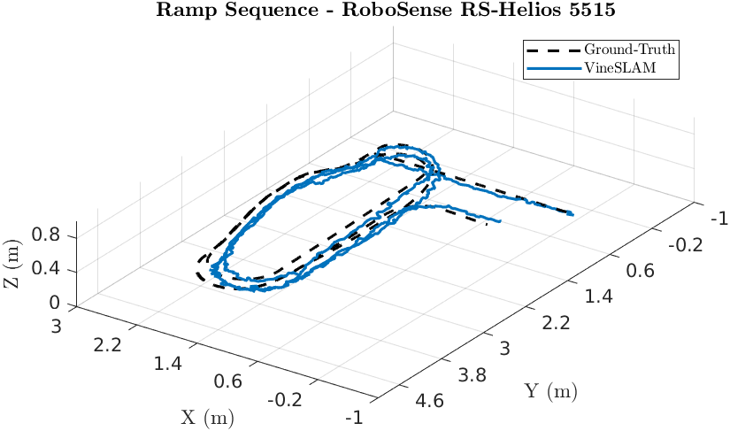

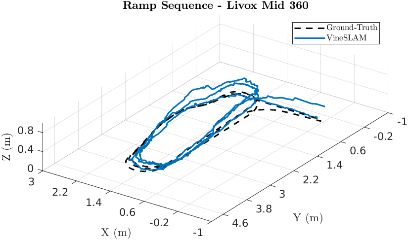

### Elevator Sequence 

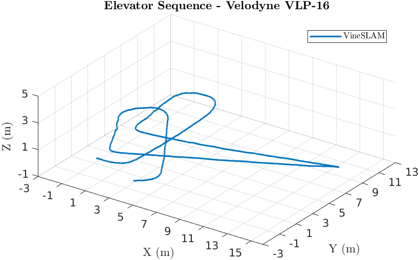

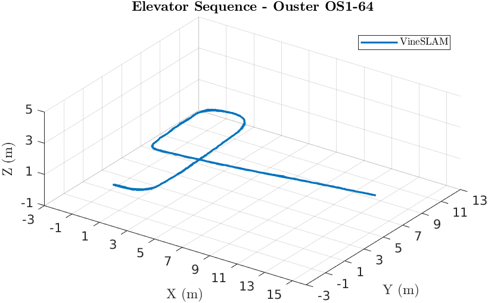

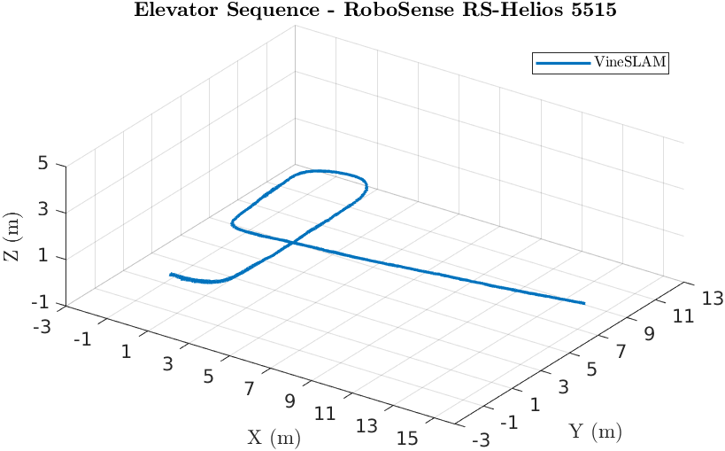

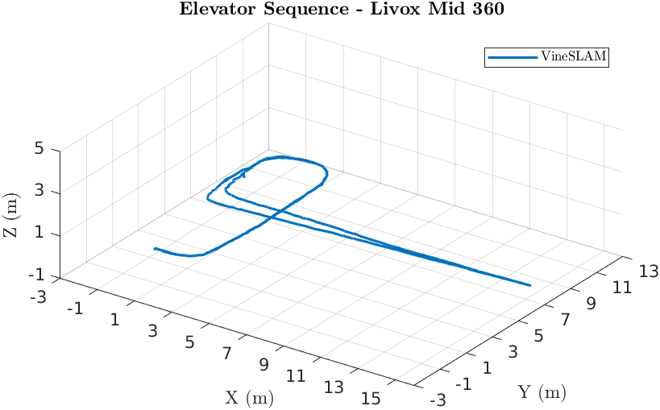

