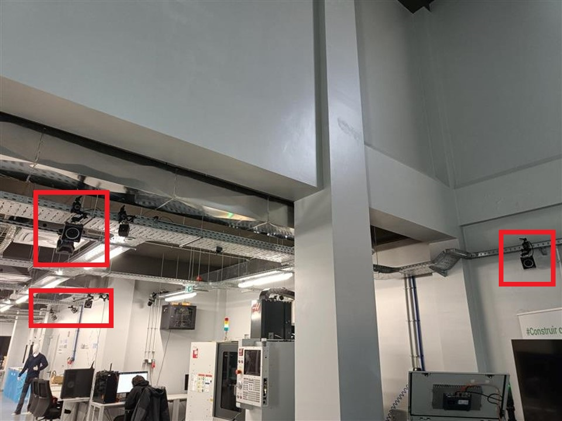
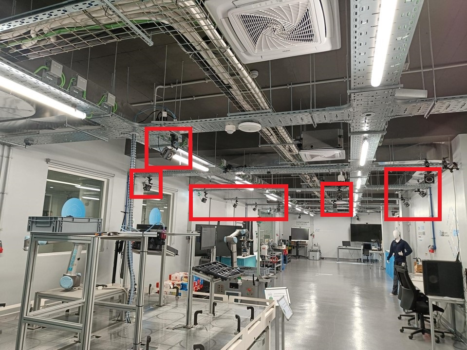
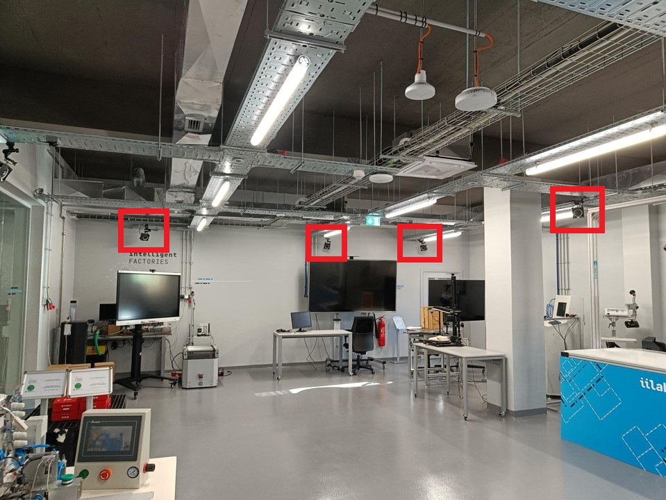
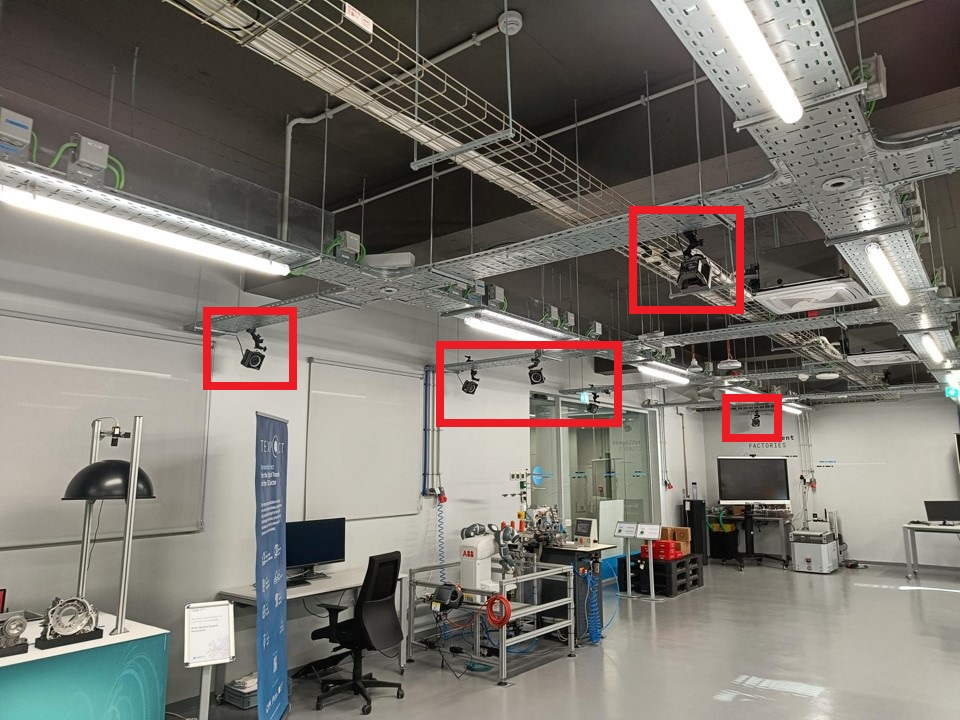

# Ground Truth System

The ground truth data for the IILABS 3D dataset was captured using an OptiTrack Motion Capture (MoCap) system featuring 24 high-resolution PrimeX 22 cameras. This system was installed in Nav A, Floor 0 at the Industry and Innovation Laboratory.

### System Components

The OptiTrack system consists of the following components:

- :movie_camera: 24 PrimeX 22 cameras mounted around the capture area
- :desktop_computer: Primary Windows computer running Motive software
- :computer: Secondary Ubuntu machine running the NatNet 4 ROS driver
- :timer: Network Time Protocol (NTP) for temporal synchronization

### Data Collection Process

The ground truth data collection process involved several steps:

1. The 24 PrimeX 22 cameras were connected via Ethernet to a primary Windows computer running the [Motive software](https://optitrack.com/software/motive).
2. The Motive software processed the camera data to track the position and orientation of the mobile robot.
3. The Windows computer was connected via Ethernet to a secondary Ubuntu machine running the [NatNet 4 ROS driver](https://github.com/L2S-lab/natnet_ros_cpp).
4. The driver published the tracking data as ROS topics, which were recorded into rosbag files.
5. Temporal synchronization between the robot platform and the ground-truth system was achieved using the Network Time Protocol (NTP).

!!! info "Post-Processing"
    The bag files were processed using the [EVO open-source Python library](https://github.com/MichaelGrupp/evo) to convert the data into TUM format and adjust the initial position offsets for accurate SLAM odometry benchmarking.

## Ground Truth Data Format

The ground truth data is provided in TUM format, which is a standard format for trajectory data in robotics research. The TUM format consists of text files with each line containing:

- Timestamp (in seconds)
- Three columns for position coordinates (x, y, z)
- Four columns for orientation in quaternion format (qx, qy, qz, qw)

```
# Example of ground truth data in TUM format
1615554087.134 0.0123 -0.0456 0.0789 0.0012 0.0034 0.0056 0.9999
```

### Reference Frame

The ground truth data is provided in the robot's `base_link` frame. This is important to note when comparing SLAM algorithm outputs with the ground truth, as the odometry data from SLAM algorithms may be in different reference frames (e.g., `base_footprint`, `imu`, or `lidar` frames).

!!! tip "Reference Frame Correction"
    The IILABS 3D toolkit provides a command to correct the reference frame of trajectory data:
    ```bash
    iilabs3d correct-frame <trajectory.tum> <ref_frame> [--sensor <sensor_name>]
    ```

## Accuracy and Precision

The OptiTrack motion capture system provides highly accurate position and orientation measurements with:

- Sub-millimeter position accuracy
- Sub-degree orientation accuracy

This high level of precision makes the ground truth data suitable for rigorous evaluation of SLAM algorithms, allowing researchers to accurately measure the performance of different algorithms in terms of trajectory accuracy and drift.

## Accessing Ground Truth Data

Ground truth data is included with each sequence in the dataset. When you download a sequence using the IILABS 3D toolkit, the ground truth data is provided as a `ground_truth.tum` file in the sequence directory:

```
<save_directory>/iilabs3d-dataset/<sequence_prefix>/<sequence_name>/ground_truth.tum
```

You can use this ground truth data to evaluate the performance of SLAM algorithms by comparing their estimated trajectories with the ground truth using the evaluation tools provided in the IILABS 3D toolkit.

## Gallery

<div class="grid" markdown>









</div>