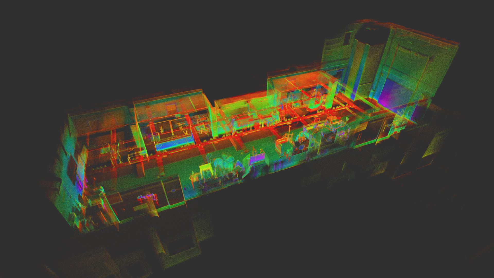

# Dataset

The IILABS 3D dataset was collected in the Industry and Innovation Laboratory and both calibration and benchmark sequences. Each sequence contains data from multiple sensors, complemented by high-precision ground truth obtained via a Motion Capture (MoCap) system.

{ loading=lazy }

### Key Features

- :material-rotate-3d: **Multiple 3D LiDAR Sensors**: Data from four distinct 3D LiDAR sensors with different characteristics
- :material-compass: **Additional Sensors**: 2D LiDAR, IMU, and wheel odometry data
- :material-map-marker-path: **Diverse Sequences**: Both calibration sequences and challenging benchmark trajectories
- :material-ruler: **High-Precision Ground Truth**: Sub-millimeter accuracy from a 24-camera OptiTrack system

## Sensors

The dataset includes data from the following sensors:

### 3D LiDARs

- **Livox Mid-360**: Solid-state LiDAR with an non-repetitive scanning pattern
- **Ouster OS1-64 RevC**: 64-channel mechanical spinning LiDAR (45° uniform vertical FOV)
- **RoboSense RS-HELIOS-5515**: 32-channel mechanical spinning LiDAR (70° non-uniform vertical FOV)
- **Velodyne VLP-16**: 16-channel mechanical spinning LiDAR (30° uniform vertical FOV)

### Additional Sensors

- **Hokuyo UST-10LX-H01**: 2D LiDAR
- **Xsens MTi-630 AHRS**: Inertial Measurement Unit (IMU)
- **Faulhaber 2342 wheel encoders**: 64:1 gear ratio, 12 Counts Per Revolution (CPR)

!!! info "Sensor Details"
    For detailed specifications of each sensor, please refer to the [Sensors](../sensors/index.md) section.

## Data Formats

The dataset provides three types of data:

1. **Sensor Data**: Provided in ROS 1 bag files, with each file representing a sequence during which the robot followed a defined trajectory.

2. **Ground Truth Data**: Available as text files in TUM format (8 columns: timestamp in seconds, three columns for position coordinates, and four columns for orientation in quaternion format).

3. **Calibration Files**: Supplied in YAML format, containing the calibration parameters for each sensor.

## Data Collection Method

=== "Sensor Data Collection"

    Sensor data was captured using the Robot Operating System (ROS) framework's rosbag record tool on a LattePanda 3 Delta embedded computer. Post-processing involved timestamp correction for the Xsens MTi-630 AHRS IMU via custom Python scripts.

=== "Ground Truth Collection"

    Ground-truth data was captured using an OptiTrack MoCap system featuring 24 high-resolution PrimeX 22 cameras. These cameras were connected via Ethernet to a primary Windows computer running the Motive software, which processed the camera data. This Windows computer was then connected via Ethernet to a secondary Ubuntu machine running the NatNet 4 ROS driver.

=== "Synchronization"

    Temporal synchronization between the robot platform and the ground-truth system was achieved using the Network Time Protocol (NTP). The bag files were processed using the EVO open-source Python library to convert the data into TUM format and adjust the initial position offsets for accurate SLAM odometry benchmarking.

## Accessing the Dataset

The IILABS 3D dataset is available at the [INESC TEC research data repository](https://rdm.inesctec.pt/dataset/nis-2025-001). The dataset is approximately 350 GB in size.

### Using the IILABS 3D Toolkit

The easiest way to access and work with the dataset is through the [IILABS 3D Toolkit](https://github.com/JorgeDFR/iilabs3d-toolkit), a Python package that provides utilities for working with the dataset.

```bash
# Install the toolkit
pip install iilabs3d-toolkit

# List available sequences
iilabs3d list-sequences

# List available sensors
iilabs3d list-sensors

# Download a specific sequence for a specific sensor
iilabs3d download ~/data bench/loop livox_mid-360
```

!!! tip "Downloading All Data"
    To download all benchmark sequences for all sensors:
    ```bash
    iilabs3d download ~/data bench all
    ```

For more information on using the toolkit, see the [Usage](../usage.md) page.