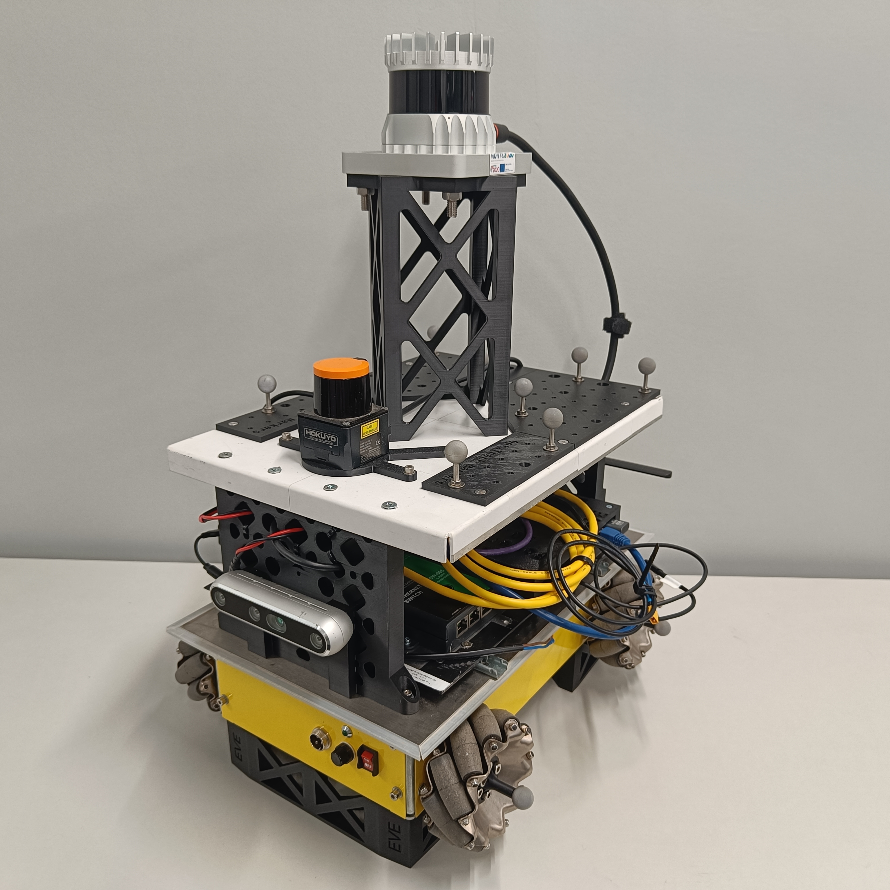
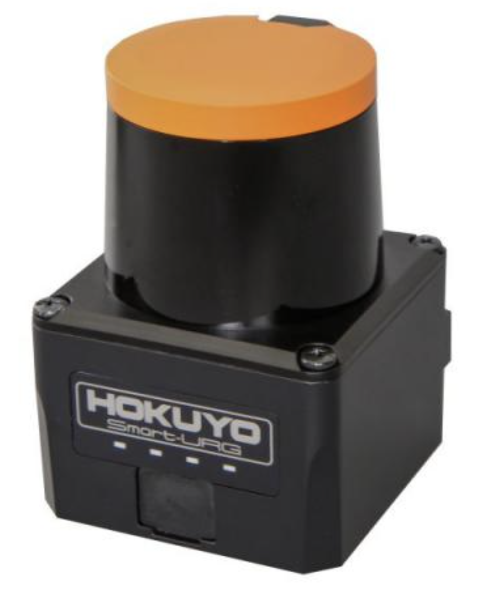

# Mobile Robot

The IILABS 3D dataset was collected using the [INESC TEC MRDT Modified Hangfa Discovery Q2 Platform](https://sousarbarb.github.io/inesctec_mrdt_hangfa_discovery_q2/). This platform was specifically adapted for multi-sensor data collection in indoor environments, with a focus on 3D LiDAR-based SLAM research.

## Robot Specifications

### Base Platform

The base platform is a modified Hangfa Discovery Q2, which has been customized by the INESC TEC Mobile Robot Dream Team (MRDT) to accommodate multiple sensors and provide a stable platform for data collection.

### Dimensions

- **Length**: 500 mm
- **Width**: 400 mm
- **Height**: 600 mm (including sensor mounts)

### Locomotion System

- :material-robot: **Drive Type**: Omnidirectional drive (Mecanum wheels)
- :material-engine: **Motors**: 2 × Faulhaber 2342 DC motors
- :material-cog: **Gear Ratio**: 64:1
- :material-counter: **Wheel Encoders**: 12 Counts Per Revolution (CPR)
- :material-speedometer: **Maximum Speed**: 0.65 m/s

### Power System

- :material-battery: **Battery**: 24V LiPo battery
- :material-battery-charging: **Capacity**: 10 Ah
- :material-clock-time-four: **Runtime**: Approximately 3 hours of continuous operation

### Computing System

- :material-laptop: **Onboard Computer**: LattePanda 3 Delta embedded computer
- :material-cpu-64-bit: **Processor**: Intel N100 (4 cores, 4 threads)
- :material-memory: **RAM**: 16 GB
- :material-harddisk: **Storage**: 512 GB SSD
- :material-ubuntu: **Operating System**: Ubuntu 20.04 with ROS Noetic

## Sensor Configuration

The mobile robot is equipped with multiple sensors to provide comprehensive data for SLAM benchmark:

### 3D LiDARs

=== "Livox Mid-360"
    

    - **Field of View**: 360° horizontal, 59° vertical
    - **Vertical Type**: non-repetitive
    - **Range**: 70m
    - **Rate**: 10Hz
    - **Points per Second**: ~200,000

=== "Ouster OS1-64"
    

    

    

    

    - **Field of View**: 360° horizontal, 45° vertical
    - **Vertical Type**: rotational uniform
    - **Range**: 120m
    - **Rate**: 10Hz
    - **Points per Second**: ~1,310,720

=== "RoboSense RS-Helios-5515"
    

    

    
    
    

    
    - **Field of View**: 360° horizontal, 70° vertical
    - **Vertical Type**: rotational non-uniform 
    - **Range**: 150m
    - **Rate**: 10Hz
    - **Points per Second**: ~1,152,000

=== "Velodyne VLP-16"
    

    

    
    
    

      
    - **Field of View**: 360° horizontal, 30° vertical
    - **Vertical Type**: rotational uniform
    - **Range**: 100m
    - **Rate**: 10Hz
    - **Points per Second**: ~288,000

 	 		
### 2D LiDAR

=== "Hokuyo UST-10LX-H01"
    

    

    
    
    

    - **Field of View**: 270° 
    - **Type**: Time of Flight (ToF)
    - **Range**: 10m
    - **Rate**: 40Hz
    - **Points per Second**: ~86,400

### Inertial Measurement Unit (IMU)

=== "Xsens MTi-630 AHRS"
    

    

    
    
    

    - **Attitude Accuracy (Roll)**: 0.2° (RMS)
    - **Attitude Accuracy (Pitch)**: 0.2° (RMS)
    - **Attitude Accuracy (Yaw)**: 1° (RMS)
    - **Rate**: 400Hz

!!! info "Additional Information"
    For more detailed information about the sensor specifications, please refer to the [Sensors](../sensors/index.md) section.

### Reference Frames

The robot uses the following reference frames:

- **base_link**: The main reference frame, located at the center of the robot wheels
- **base_footprint**: Located directly below *base_link*, on the ground plane
- **imu**: Located at the center of the IMU
- **lidar_***: Located at the center of each LiDAR sensor (e.g., lidar_livox_mid_360)

!!! info "Transformations"
    The transformations between these reference frames are provided both in the *tf* topic in the rosbag files and in the calibration files included with the dataset.

## Gallery

