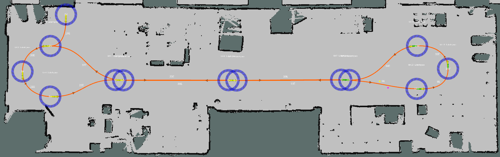
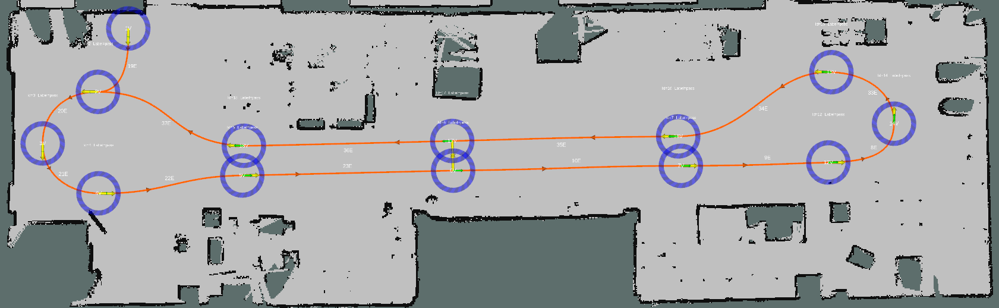
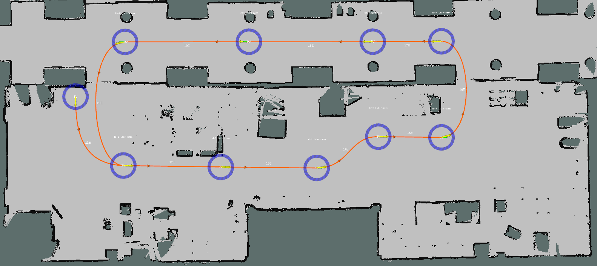
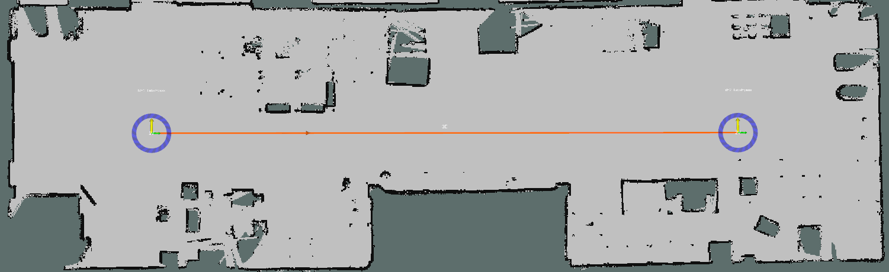
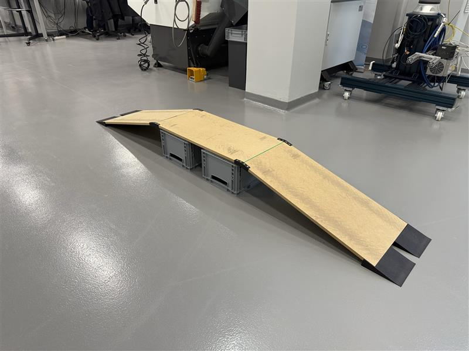
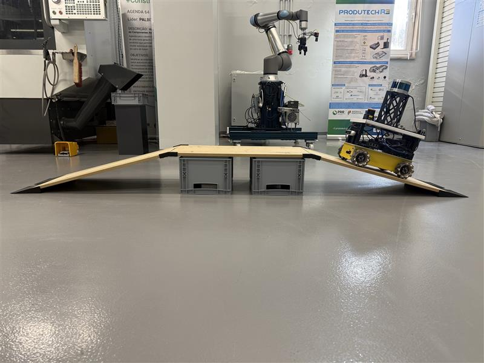
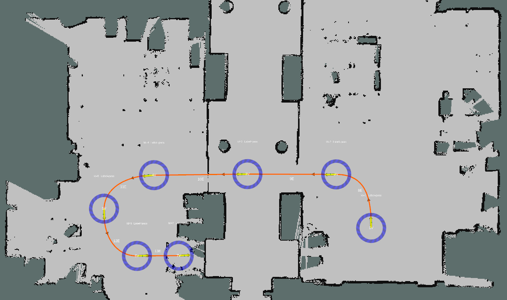
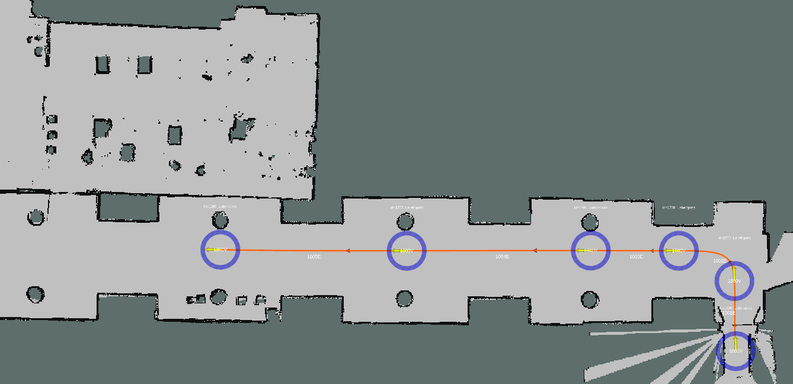

# Benchmark Sequences

Benchmark sequences are designed to challenge SLAM algorithms with realistic indoor navigation scenarios. They serve several important purposes:

- :material-speedometer: **Performance Evaluation**: Evaluate algorithms in challenging real-world conditions
- :material-compare: **Algorithm Comparison**: Compare different algorithms under identical conditions
- :material-shield-check: **Robustness Testing**: Test algorithm resilience against various challenges
- :material-chart-line: **Research Advancement**: Identify strengths and weaknesses of current approaches

The IILABS 3D dataset includes the following benchmark sequences:

## Nav A Diff



**Description**: A trajectory with a loop arround the Nav A space of the iilab.

**Purpose**: This sequence serves as a baseline, capturing typical environmental conditions without additional challenges.

**Challenge(s)**: No specific challenge

**Number of Cycle(s)**: 5 cycles

**Length**: Approximately 275 meters

**Duration**: Approximately 13 minutes

## Nav A Omni



**Description**: 

**Purpose**: This sequence tests the algorithm's ability to handle complex movement patterns with decoupled translational and rotational planar motions of an omnidirectional steering platform.

**Challenge(s)**: Omnidirectional movement

**Number of Cycle(s)**: 2 cycles

**Length**: Approximately 112 meters

**Duration**: Approximately 7 minutes

## Loop



**Description**: A trajectory that includes a large loop around the main area of the iilab, where the robot exits and re-enters the Nav A space via different doors, briefly traversing an external corridor.

**Purpose**: This sequence tests the algorithm's loop closure capabilities and global consistency.

**Challenge(s)**: Loop closure, sudden environmental changes (traversing doors)

**Number of Cycle(s)**: 5 cycles

**Length**: Approximately 232 meters

**Duration**: Approximately 11 minutes

!!! info "Ground Truth Data"
    In the *loop* sequence, the mobile robot temporarily exists in the Nav A space and enters the external corridor. Since the ground-truth system is installed in the Nav A space, ground-truth data is only provided when the robot is inside the Nav A.

## Slippage



**Description**: A trajectory involving a straight-line path where the robot executes high-speed lateral motions to intentionally induce wheel slippage.

**Purpose**: This sequence tests the algorithm's robustness to wheel odometry drift caused by wheel slippage.

**Challenge(s)**: Wheel slippage, wheel odometry drift, wheel odometry errors

**Number of Cycle(s)**: 1 cycle

**Length**: Approximately 39 meters

**Duration**: Approximately 2 minutes

## Ramp

<div class="grid" markdown>





</div>

**Description**: A trajectory that includes navigating up and down a ramp.

**Purpose**: This sequence tests the algorithm's ability to handle elevation changes and maintain accurate pose estimation during inclines and declines.

**Challenge(s)**: Elevation changes, pitch rotations

**Number of Cycle(s)**: 3 cycles

**Length**: Approximately 29 meters

**Duration**: Approximately 3 minutes

!!! info "Mobile Robot Control"
    In the *ramp* sequence, the mobile robot was controlled via a joystick, differently from the remaining sequences where a 2D navigation stack was used instead.

## Elevator

<div class="grid" markdown>





{ width="200" }

</div>

**Description**: A trajectory that envolves an elevator to move from floor 0 and 1, with a period of time inside the closed elevator.

**Purpose**: This sequence tests the algorithm's robustness to sudden changes in the environment and ability to recover from temporary loss of features. Moreover it also tests the algorithm's ability to accurately perform sensor fusion (e.g., using IMU data) for vertical motion estimations.

**Challenge(s)**: Sudden environment changes, feature loss, recovery, vertical motion

**Number of Cycle(s)**: 1 cycle

**Length**: Approximately 85 meters

**Duration**: Approximately 7 minutes

!!! info "Ground Truth Data"
    In the *elevator* sequence, the mobile robot temporarily exists in the Nav A space and enters the external corridor, in order to access the elevator and move to the second floor. Since the ground-truth system is installed in the Nav A space, ground-truth data is only provided when the robot is inside the Nav A.

## Accessing Benchmark Sequences

You can download benchmark sequences using the IILABS 3D toolkit:

```bash
iilabs3d download <output_directory> <sequence_name> <sensor_name>
```

For example, to download the loop benchmark sequence for the Livox Mid-360 sensor:

```bash
iilabs3d download ~/slam_data loop livox_mid_360
```

!!! tip "Downloading All Benchmark Sequences"
    To download all benchmark sequences for all sensors:
    ```bash
    iilabs3d download ~/slam_data bench all
    ```