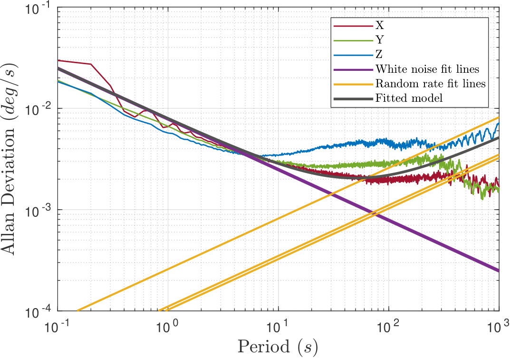
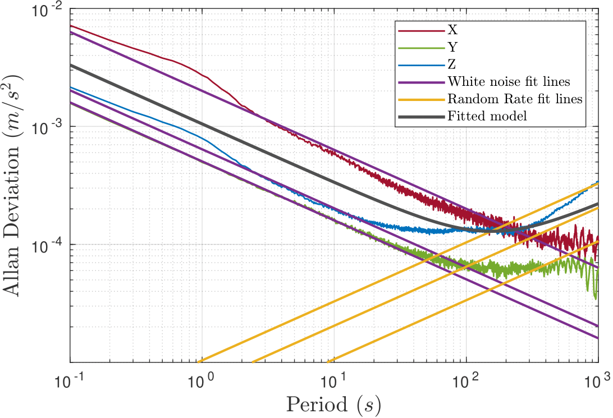
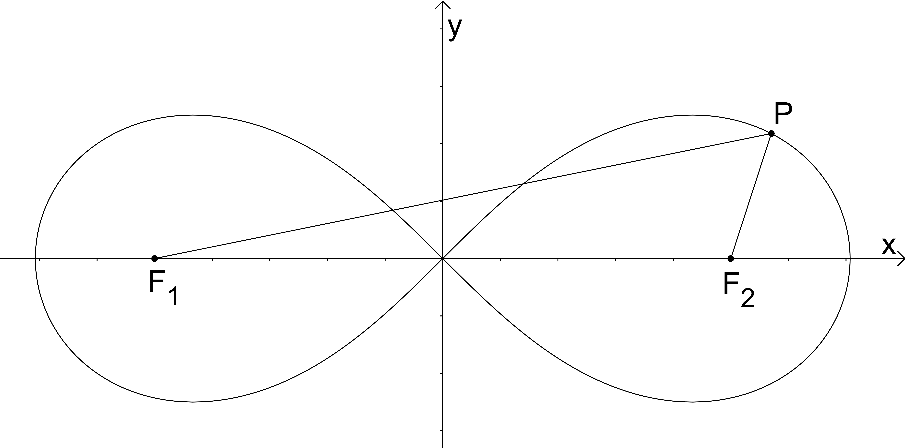
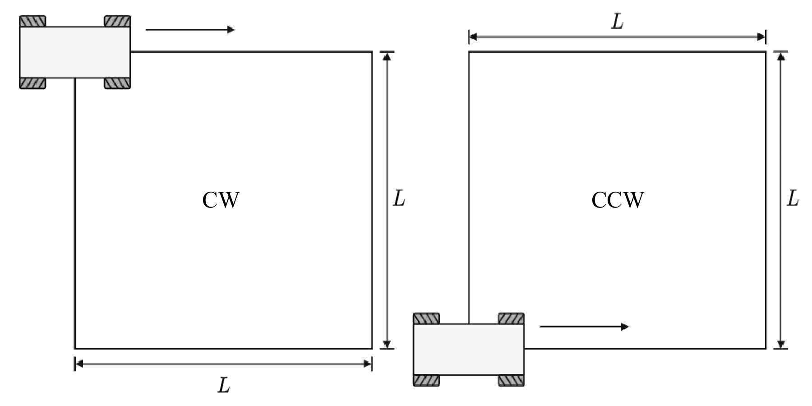

# Calibration Sequences

Calibration sequences are specifically designed to validate and optimize the calibration parameters provided with the dataset. As such they serve the following purposes:

- :material-check-circle: **Validation**: Verify the accuracy of the provided calibration parameters
- :material-tune: **Optimization**: Provide data for researchers to derive more optimal calibration parameters

!!! info "Calibration Parameters"
    The IILABS 3D dataset includes pre-calibrated parameters in YAML format for all sensors. These calibration sequences provide a way to validate these parameters or derive new ones if needed.

## IMU Intrinsic Calibration

To characterize each IMU's noise and bias behaviour, we recorded a three-hour stationary sequence for each of the following sensors:

- Xsens MTi-630 AHRS (external IMU)  
- Ouster OS1-64 (internal IMU)  
- Livox Mid-360 (internal IMU)  

From these recordings, Allan-variance plots can be generated to estimate the noise and bias of both the gyroscope and accelerometer. In our benchmark, we used the [Allan Variance ROS package](https://github.com/ori-drs/allan_variance_ros) to estimate these values and provide them in the YAML calibration files.
For illustrative purposes, the following figures represent the Allan-variance plots obtained for the Xsens MTi-630 AHRS IMU.

<div class="grid" markdown>



</div>

!!! info "Parameter Adjustment"
    To ensure a safe margin in the benchmark study, the YAML file values were inflated – bias values by a factor of 10 and white noise values by a factor of 5.

## Extrinsic Calibration (LiDAR – IMU)

To determine the rigid‐body transform between each 3D LiDAR and the IMU, we recorded two complementary sequences:

### Full Excite Sequence

- **Setup**: Robot suspended in free space  
- **Motion**: Continuous rotations about the z-axis plus oscillations along the x- and y-axes  
- **Use case**: Ideal for six-degree-of-freedom IMU–LiDAR solvers requiring full-axis excitation (e.g., [LI-Init](https://github.com/hku-mars/LiDAR_IMU_Init))


!!! note "Illustration"  
    Example GIF sourced from the [LI-Init GitHub repository](https://github.com/hku-mars/LiDAR_IMU_Init) to demonstrate the excitation pattern. Actual dataset sequence uses the same motion profile for calibration.

### Infinity Sequence (Lemniscate of Bernoulli)

- **Path**: Floor-level figure-eight (lemniscate) trajectory  
- **Equation**:  \(
    x(t) = \frac{a\cos t}{1 + \sin^2 t}, 
    \quad
    y(t) = \frac{a\sin t\cos t}{1 + \sin^2 t},
    \quad a = c\sqrt{2},
    \quad PF_1 \cdot PF_2 = c^2
    \)
- **Use case**: Suited for ground-robot calibration algorithms exploiting planar constraints (e.g., [GRIL-Calib](https://github.com/Taeyoung96/GRIL-Calib))



## Wheel Odometry Calibration

The dataset includes wheel odometry calibration sequences that consist of 2m×2m square-shaped trajectories, a widely used approach for odometry calibration in mobile robotics.



Four distinct trajectory patterns were executed:

| Pattern                  | Description                                        | Cycles | Length  | Duration   |
| ------------------------ | -------------------------------------------------- | ------ | ------- | ---------- |
| **CW with Rotation**     | Clockwise square, rotate in place at each corner   | 2      | ~16 m   | ~2 min     |
| **CW without Rotation**  | Clockwise square, pure 90° turns                   | 2      | ~16 m   | ~1 min     |
| **CCW with Rotation**    | Counterclockwise square, rotate at each corner     | 2      | ~16 m   | ~2 min     |
| **CCW without Rotation** | Counterclockwise square, pure 90° turns            | 2      | ~16 m   | ~1 min     |

The dataset includes sixteen odometry calibration sequences in total:

- Four trajectory patterns (as described above)
- Repeated for each of the four 3D LiDAR sensors

!!! note "Sensor Independence"
    Although odometry calibration parameters are independent of other sensors, including the 3D LiDARs, providing multiple sequences enhances the precision and reliability of the calibration process.

!!! tip "Additional Uses"
    These sequences can also serve as alternative data for extrinsic calibration algorithms, complementing or substituting the other 2 extrinsic calibration sequences when needed.

## Accessing Calibration Sequences

You can download calibration sequences using the IILABS 3D toolkit:

```bash
iilabs3d download <output_directory> <sequence_name> <sensor_name>
```

For example, to download the full excite calibration sequence for the Livox Mid-360 sensor:

```bash
iilabs3d download ~/slam_data calib_full_excite livox_mid_360
```

!!! tip "Downloading All Calibration Sequences"
    To download all calibration sequences for all sensors:
    ```bash
    iilabs3d download ~/slam_data calib all
    ```