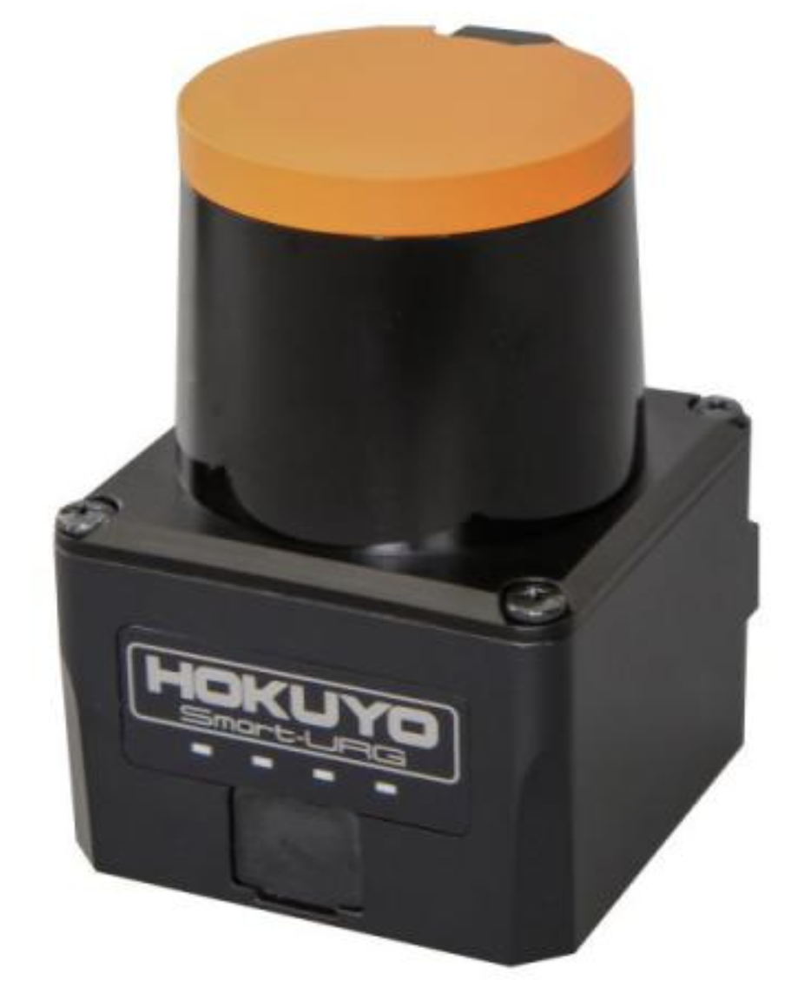

# Hokuyo UST-10LX

## Links

- [Hokuyo UST-10LX](https://www.hokuyo-aut.jp/search/single.php?serial=167)

## Documents

- [Hokuyo UST-10LX Instruction Manual](../../../assets/sensors/lidar2d/hokuyo_ust-10lx/hokuyo_ust-10lx_instruction-manual.pdf)
- [Hokuyo UST-10LX Datasheet](../../../assets/sensors/lidar2d/hokuyo_ust-10lx/hokuyo_ust-10lx_datasheet.pdf)
- [Hokuyo UST-10LX-H01 Datasheet](../../../assets/sensors/lidar2d/hokuyo_ust-10lx/hokuyo_ust-10lx-h01_datasheet.pdf)
- [Hokuyo UST-10LX UST Communication Protocol Specification](../../../assets/sensors/lidar2d/hokuyo_ust-10lx/hokuyo_ust-10lx_ust-communication-protocol.pdf)
- [Hokuyo UST-10LX IP Discovery Tool](../../../assets/sensors/lidar2d/hokuyo_ust-10lx/hokuyo_ust-10lx_ip-discovery-tool_v2.1.zip)
- [Hokuyo UST-10LX 3D Model (STEP)](../../../assets/sensors/lidar2d/hokuyo_ust-10lx/hokuyo_ust-10lx_3d-model.STEP)

## Gallery

